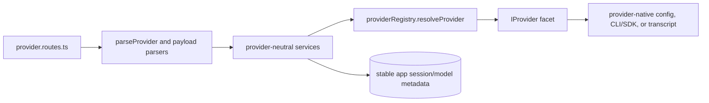
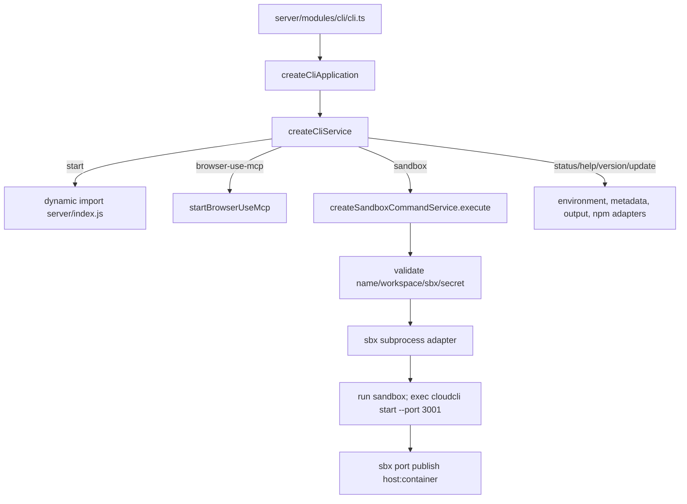

# Backend Agent, Provider, and CLI Execution Map

## Scope and boundaries

This chapter maps backend execution from the external Agent HTTP endpoint and the application's provider-neutral runtime dispatcher into concrete Claude, Codex, Cursor, and OpenCode integrations. It also maps the separate `cloudcli` executable and its Docker AI Sandbox (`sbx`) command path.

- **In scope:** `server/modules/agent`, `server/modules/providers`, and `server/modules/cli`; their composition in `server/index.ts`; provider contracts in `server/shared/interfaces.ts` and execution/CLI types in `server/shared/types.ts`.
- **Adjacent, not expanded here:** authenticated middleware and server bootstrap, WebSocket transport/run-state management, database implementation, Git/worktree APIs, and frontend chat state. The realtime chat path is named below only where it enters the provider runtime boundary.

## Primary entry points

| Entry | Path | Role |
|---|---|---|
| `createAgentModule` | `server/modules/agent/agent.module.ts` | Production composition root for `/api/agent`; injects filesystem, process, database, GitHub, model, and provider-runner dependencies into the router. |
| `createAgentRouter` | `server/modules/agent/agent.routes.ts` | Defines the API-key-protected `POST /` execution route and its clone/project, streaming, provider dispatch, optional branch/PR, response, and cleanup lifecycle. |
| `providerRoutes` default router | `server/modules/providers/provider.routes.ts` | Authenticated `/api/providers` API for provider auth, models, agents, skills, MCP, capabilities, and session lifecycle/history/search. |
| `providerRegistry` | `server/modules/providers/provider.registry.ts` | Owns the four concrete `IProvider` objects and resolves an `LLMProvider` id to one integration. |
| `providerRuntimeService` | `server/modules/providers/services/provider-runtime.service.ts` | Application-facing execution dispatcher used by Agent and realtime chat flows. |
| `createCliApplication` | `server/modules/cli/cli.module.ts` | CLI composition root: package metadata, environment, filesystem, subprocess, sandbox, server, and browser-use MCP adapters. |
| `cliApplication.run` | `server/modules/cli/cli.ts` | Executable boundary; passes `process.argv.slice(2)` to the CLI and maps success/errors to `process.exitCode`. |

`server/index.ts` creates fixed runners with `providerRuntimeService.getRunner('claude' | 'cursor' | 'codex' | 'opencode')`, injects them into `createAgentModule`, mounts that router at `/api/agent`, mounts `providerRoutes` at `/api/providers`, and supplies the same runtime service to WebSocket chat.

## Important symbols

### Agent request execution

| Symbol | Path | Responsibility |
|---|---|---|
| `AgentRouterDependencies` | `server/modules/agent/agent.routes.ts` | Injectable boundary for Node/GitHub infrastructure, repositories, model lookup, and four `ProviderRunFunction` runners. |
| `validateExternalApiKey` | `server/modules/agent/agent.routes.ts` | Route-local middleware: trusts the default user in platform mode; otherwise validates `x-api-key` or `apiKey`. |
| `POST /` handler | `server/modules/agent/agent.routes.ts` | Validates request options, resolves/clones the project, selects stream mode and provider, then handles optional GitHub and cleanup work. |
| `SSEStreamWriter` | `server/modules/agent/agent.routes.ts` | Adapts provider events to an SSE response and tracks session/token state. |
| `ResponseCollector` | `server/modules/agent/agent.routes.ts` | Collects provider output for the non-streaming JSON response. |
| `cloneGitHubRepo`, `cleanupProject` | `server/modules/agent/agent.routes.ts` | Manage temporary external repository setup and delayed/error cleanup. |
| `getGitRemoteUrl`, `parseGitHubUrl`, `autogenerateBranchName`, `validateBranchName`, `createGitHubPR` | `server/modules/agent/agent.routes.ts` | Support the optional post-run branch/push/pull-request workflow. |

### Provider contracts and selection

| Symbol | Path | Responsibility |
|---|---|---|
| `LLMProvider` | `server/shared/types.ts` | Closed provider id union: `'claude' | 'codex' | 'cursor' | 'opencode'`. |
| `IProvider` | `server/shared/interfaces.ts` | Composite provider contract: `runtime`, `models`, `mcp`, `auth`, `skills`, `sessions`, `sessionSynchronizer`, and optional `agents`. |
| `IProviderRuntime` | `server/shared/interfaces.ts` | Native execution adapter contract: `run`, `abort`, and optional permission gateway. |
| `IProviderModels`, `IProviderAuth`, `IProviderAgents`, `IProviderSkills`, `IProviderMcp`, `IProviderSessions`, `IProviderSessionSynchronizer` | `server/shared/interfaces.ts` | Facet contracts consumed by provider-neutral services and routes. |
| `AbstractProvider` | `server/modules/providers/shared/base/abstract.provider.ts` | Base class fixing the provider id and required facets while leaving concrete integrations to supply implementations. |
| `ClaudeProvider`, `CodexProvider`, `CursorProvider`, `OpenCodeProvider` | `server/modules/providers/list/*/*.provider.ts` | Concrete composite integrations instantiated by the registry. `OpenCodeProvider` also supplies the optional `agents` facet. |
| `providerRegistry.listProviders`, `providerRegistry.resolveProvider` | `server/modules/providers/provider.registry.ts` | Enumerate integrations or reject an unsupported provider with `UNSUPPORTED_PROVIDER`. |
| `createProviderRuntimeService` | `server/modules/providers/services/provider-runtime.service.ts` | Builds an injectable provider runtime dispatcher for production and focused tests. |
| `run`, `getRunner`, `abort` | `server/modules/providers/services/provider-runtime.service.ts` | Resolve the concrete provider, construct runtime context, execute/stop it, or bind an id-specific runner. |
| `resolveToolApproval`, `getPendingApprovalsForSession` | `server/modules/providers/services/provider-runtime.service.ts` | Cross-provider permission-decision and pending-approval boundary. |
| `providerModelsService` | `server/modules/providers/services/provider-models.service.ts` | Catalog caching plus active/resume model selection; `resolveResumeModel` is used in runtime context. |
| `providerAgentsService`, `OpenCodeAgentsProvider.listAvailableAgents` | `server/modules/providers/services/agents.service.ts`, `server/modules/providers/list/opencode/opencode-agents.provider.ts` | Workspace-keyed OpenCode catalog discovery coalesces identical reads, briefly caches successful results, supports explicit refresh, bounds detail CLI concurrency to four, and invalidates all workspace results after global definition/preference mutations. |
| `sessionsService` | `server/modules/providers/services/sessions.service.ts` | Stable app-session allocation, provider-session resolution, metadata/lifecycle, and provider-delegated history loading. |
| `listOpenCodeChildActivitySnapshots`, `listOpenCodeRunningChildSessions` | `server/modules/providers/list/opencode/opencode-activity-inspector.provider.ts` | Read one short-lived, database-identity-keyed native activity snapshot shared by running, lifecycle, and recovery consumers; SQL prefilters likely Task rows and batches child timestamps across compatible tables. |
| `sessionSynchronizerService`, `initializeSessionsWatcher` | `server/modules/providers/services/session-synchronizer.service.ts`, `server/modules/providers/services/sessions-watcher.service.ts` | Full and incremental indexing of provider-native session artifacts into app session records. |

### Provider HTTP route groups

`server/modules/providers/provider.routes.ts` validates provider/path/query/body input before calling provider-neutral services. Major groups are:

- `GET /:provider/auth/status` and `GET /:provider/models`.
- Active model read/write at `/:provider/sessions/:sessionId/active-model`.
- Optional provider agent definitions/preferences under `/:provider/agents`.
- Skill and MCP CRUD under `/:provider/skills` and `/:provider/mcp/servers`; `POST /mcp/servers/global` fans out through the service layer.
- Capability discovery at `/capabilities` and `/:provider/capabilities`.
- Stable session allocation and lifecycle under `/sessions`, including manifest/running/status/archive, start, details, provider-id mapping, token usage, rename, restore/delete, and paginated/ETag history.
- SSE conversation search at `GET /search/sessions`.

### CLI and sandbox

| Symbol | Path | Responsibility |
|---|---|---|
| `CliApplication`, `CliPackageMetadata` | `server/shared/types.ts` | Public CLI application and package metadata contracts. |
| `createCliService` | `server/modules/cli/cli.service.ts` | Parses global options and dispatches `start`, `sandbox`, `browser-use-mcp`, `status`/`info`, `help`, `version`, and `update`. |
| `parseCliArguments` | `server/modules/cli/cli.service.ts` | Separates global options, command, and remaining arguments. |
| `createSandboxCommandService` | `server/modules/cli/sandbox.service.ts` | Implements `sbx` create/start/list/stop/remove/log behavior behind injected adapters. |
| `parseSandboxArguments`, `publishSandboxPort` | `server/modules/cli/sandbox.service.ts` | Normalize sandbox options and expose the sandbox's CloudCLI port. |
| `SANDBOX_TEMPLATES`, `SANDBOX_SECRETS` | `server/modules/cli/sandbox.service.ts` | Map agent choices to sandbox templates and required global secret names. |

## Main execution lifecycles

### External Agent HTTP execution

```mermaid
sequenceDiagram
  participant Client
  participant Agent as POST /api/agent
  participant Project as filesystem/git/projectsDb
  participant Models as providerModelsService
  participant Runner as bound ProviderRunFunction
  participant Runtime as providerRuntimeService
  participant Provider as IProvider.runtime

  Client->>Agent: request + API key
  Agent->>Agent: authenticate and validate options/provider
  Agent->>Project: clone GitHub repo or verify normalized projectPath
  Agent->>Project: register project
  Agent->>Agent: create SSEStreamWriter or ResponseCollector
  Agent->>Models: load defaults where required
  Agent->>Runner: message, runtime options, writer
  Runner->>Runtime: run(fixed provider id, ...)
  Runtime->>Provider: run(..., ProviderRuntimeContext)
  Provider-->>Agent: normalized events through writer
  Agent->>Project: optional branch/push/PR; optional cloned-repo cleanup
  Agent-->>Client: SSE completion/errors or collected JSON
```

The Agent route currently validates and branches on the same four provider ids explicitly. The provider registry is the deeper integration boundary, but adding a provider also requires updating this route's validation/dispatch and server composition unless the route is first generalized.

### Application chat execution boundary

The normal interactive path enters through WebSocket chat (owned by the realtime map). At its provider boundary, `chat-run-lifecycle.service.ts` checks `providerRuntimeService.hasRuntime`, builds runtime options/writer state, calls `providerRuntimeService.run`, and calls `abort` for stop requests. The runtime service then:

1. resolves `IProvider` through `providerRegistry`;
2. builds `ProviderRuntimeContext` with provider-session mapping, resume-model resolution, optional OpenCode context-window lookup, model catalog access, message normalization, and install probing;
3. invokes `provider.runtime.run`;
4. exposes permission resolution and pending approvals without callers importing concrete integrations.

### Provider API and session boundary



Session ids are deliberately split: `sessionsService.createAppSession` allocates the stable app-facing id before first send; provider runtimes later associate native ids. History loading resolves the owning provider and delegates to `provider.sessions.fetchHistory`, then rewrites messages to the stable app id.

OpenCode running, lifecycle status, and WebSocket recovery all consume the same bounded native activity inspector snapshot. The inspector opens the external SQLite database read-only, invalidates on main/WAL file identity changes or a short TTL, parses only SQL-prefiltered Task-like parts once, and resolves child activity with batched `IN` queries rather than per-child schema scans. Missing, locked, malformed, and older schemas fail open.

### CLI and sandbox execution



## Safe extension and change points

### Adding or changing a provider

1. Implement the relevant contracts in a new `server/modules/providers/list/<provider>/` integration, normally composing them through an `AbstractProvider` subclass. Keep native event/history/config translation inside provider facets.
2. Extend `LLMProvider`, register the provider instance in `provider.registry.ts`, and add capability/service support only for facets the provider actually exposes.
3. Update Agent's explicit provider validation/dispatch and `server/index.ts` runner injection if `/api/agent` must support it. Realtime callers already select through `providerRuntimeService.run`.
4. Add provider route parsing/capability behavior and focused tests. Do not make callers import provider-specific runtime files; use registry/services/barrel exports.
5. Preserve the stable app-session/native-session boundary and normalize runtime/history messages through `IProviderSessions`.

OpenCode runtime also bounds the provider-native progressless-loop failure mode. Consecutive `step_start` records without another native event are counted against `CLOUDCLI_OPENCODE_EMPTY_STEP_THRESHOLD` (default `3`); text, reasoning, tool/Task activity, errors, step completion, stderr, and other output reset the count. Reaching the threshold emits one actionable normalized error, terminates the CLI, retains the native diagnostic logs, and follows the normal failed-run and exactly-once completion lifecycle.

### Changing execution behavior

- **Agent API orchestration:** edit `createAgentRouter` for request semantics, SSE/JSON behavior, clone/branch/PR, or cleanup. Keep dependencies injectable through `AgentRouterDependencies`/`createAgentModule`.
- **Shared runtime semantics:** edit `createProviderRuntimeService` for context, dispatch, abort, or permission behavior; keep provider-specific process/SDK details in each `*.runtime.provider.*`.
- **Model/session policy:** use `providerModelsService` and `sessionsService`, rather than duplicating model precedence or app/native session resolution in routes/runtimes.
- **Provider HTTP features:** add a validated route plus a provider-neutral service that delegates to an `IProvider` facet; extend an interface only when the capability is genuinely shared.

### Changing CLI behavior

- Add top-level commands in `createCliService` and inject new external effects through `CliServiceDependencies`; wire production adapters only in `createCliApplication`.
- Add `sbx` subcommands/options in `sandbox.service.ts`; keep command construction behind `runSandboxCommand`/`spawnDetachedSandbox` and retain name, workspace, secret, and environment validation.
- Change executable error/exit handling only in `cli.ts`; it should remain a thin boundary.

## Important files by navigation goal

| Goal | Start here |
|---|---|
| Trace `/api/agent` | `server/modules/agent/agent.routes.ts`, then `agent.module.ts` and `server/index.ts`. |
| Understand provider dispatch | `server/modules/providers/services/provider-runtime.service.ts`, `provider.registry.ts`, `server/shared/interfaces.ts`. |
| Modify one provider | Its composite `server/modules/providers/list/<provider>/<provider>.provider.ts`, then the referenced runtime/models/auth/sessions/MCP/skills/synchronizer facets. |
| Modify provider APIs | `server/modules/providers/provider.routes.ts`, then the matching `services/*.service.ts`. |
| Understand session/model selection | `services/sessions.service.ts` and `services/provider-models.service.ts`. |
| Modify `cloudcli` commands | `server/modules/cli/cli.service.ts`, then `cli.module.ts` for production wiring. |
| Modify sandbox behavior | `server/modules/cli/sandbox.service.ts`. |

## Focused tests and validation

- Agent route behavior: `server/modules/agent/tests/agent.routes.test.ts`.
- Runtime dispatch/context/abort: `server/modules/providers/tests/provider-runtime.service.test.ts`.
- Models and session policies: `server/modules/providers/tests/provider-models.service.test.ts`, `sessions.service.test.ts`, and provider-specific model/session/runtime tests under `server/modules/providers/tests/`.
- OpenCode native activity query bounding, cache invalidation, lifecycle parsing, and compatibility: `server/modules/providers/tests/opencode-activity-inspector.test.ts`.
- Provider route groups: `sessions-*.routes.test.ts`, `session-mutations.routes.test.ts`, `mcp.test.ts`, `skills.test.ts`, and `opencode-agents.test.ts`.
- OpenCode agent catalog tests inject list/detail runners to verify workspace isolation, in-flight coalescing, four-process detail bounds, refresh/invalidation, ordering/metadata, and failure recovery without depending on CLI wall-clock startup.
- CLI/sandbox dispatch: `server/modules/cli/tests/cli.service.test.ts` and `sandbox.service.test.ts`.
- For documentation validation, verify every cited symbol at its path and sample both external Agent and realtime-chat entry paths through `providerRuntimeService`; avoid treating provider-specific implementation internals as shared guarantees.
