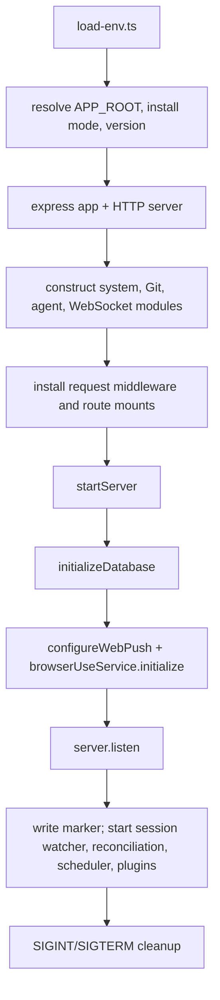
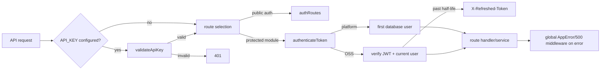

# Backend Foundations: API Composition and Authentication

## Scope and boundaries

This map covers the backend composition root, cross-cutting HTTP middleware, authentication, static/SPA delivery, attachment assets, system update endpoint, user profile endpoints, and shared backend primitives. It intentionally does not detail agent/provider execution, WebSocket event routing, workspace/Git operations, persistence internals, or integrations; follow the adjacent backend maps for those subsystems.

## Primary entry point and startup

`server/index.ts` is the executable composition root. It loads `server/load-env.ts` before other imports, locates the application root with `findApplicationRoot`, derives install mode and running version, creates the Express app and HTTP server, builds dependency-injected modules, attaches WebSocket infrastructure, mounts HTTP middleware/routes in order, and calls `startServer()`.

Important startup symbols in `server/index.ts`:

| Symbol | Role |
|---|---|
| `APP_ROOT` | Stable repository/package root used for public, built frontend, package metadata, and runtime paths. |
| `RUNNING_VERSION` | Startup-captured package version returned by `/health`; deliberately remains the version of the running process. |
| `app` / `server` | Express application and underlying `http.Server`; the latter is shared with WebSocket setup. |
| `startServer()` | Initializes durable/runtime services, begins listening, starts post-listen watchers/schedulers/plugins, and registers shutdown handlers. |
| `writeLocalServerMarker()` / `removeLocalServerMarker()` | Maintain `~/.cloudcli/local-server.json` for local-server discovery while guarding against deleting another process's marker. |
| `getErrorCode()` / `getErrorMessage()` | Narrow unknown shutdown/marker errors for logging and `ENOENT` handling. |

## HTTP request pipeline and module registration

Registration order in `server/index.ts` is behaviorally important:

1. `configureDynamicResponseCaching(app)` establishes default API caching policy.
2. Request correlation middleware uses `resolveRequestId`, returns `X-Request-ID`, and emits `createRequestCompletionDiagnostic(...)` on selected completed responses.
3. CORS exposes `X-Refreshed-Token`, `X-Auth-Error`, and `X-Request-ID`; JSON and URL-encoded parsers allow 50 MB bodies, while JSON parsing explicitly skips multipart uploads.
4. Public `GET /health` returns status, timestamp, install mode, and startup-captured version.
5. `app.use('/api', validateApiKey)` optionally gates every API route when `API_KEY` is configured.
6. Public auth endpoints mount at `/api/auth`; the Docs UI uses `authenticateDocsToken`; most feature routers use `authenticateToken`. `/api/agent` has its own API-key-oriented boundary, and `/api/browser-use-mcp` has its own local-token boundary.
7. The final `/api` handler returns structured `API_ROUTE_NOT_FOUND` JSON so unknown APIs never fall through to the SPA.
8. `dist/` is served before `public/` with `setStaticResourceCacheHeaders`, so generated artifacts (especially processed `dist/sw.js`) win while source files remain fallbacks; a narrow post-static compatibility handler maps only nested `sw.js`, `manifest.json`, and `cloudcli-version.json` requests from stale clients to their root-owned revalidated files with the same built-first worker precedence; the catch-all HTML route then sends `dist/index.html` with `REVALIDATE_CACHE_CONTROL`, or redirects to Vite when no production build exists.
9. The last middleware maps `AppError` fields to structured JSON and maps unknown errors to `INTERNAL_ERROR`.

Major registered foundation routes:

| Mount | Protection | Definition / assembly |
|---|---|---|
| `GET /health` | Public (but still under global non-route middleware) | Inline in `server/index.ts` |
| `/api/auth` | Public after optional API key | `authRoutes`, `server/modules/auth/auth.module.ts` |
| `/api/docs-ui` | Docs cookie/Bearer adaptation then JWT | `authenticateDocsToken`, `server/modules/auth/auth.middleware.ts` |
| `/api/assets` | JWT | `assetsRoutes`, `server/modules/assets/assets.routes.ts` |
| `/api/system` | JWT | `createSystemModule(...)`, `server/modules/system/system.module.ts` |
| `/api/user` | JWT | `userRoutes`, `server/modules/user/user.module.ts` |

Other route mounts in the composition root belong to adjacent maps: `backend-agent-provider-cli.md`, `backend-realtime-websocket-sessions.md`, `backend-workspaces-files-git.md`, and `backend-persistence-automation-integrations.md`.

## Authentication flow

### Composition and service

| Symbol | Path | Role |
|---|---|---|
| `createAuthService(dependencies)` | `server/modules/auth/auth.service.ts` | Application service for setup status, single-user registration, login, current user, refresh, and logout. Dependencies isolate user persistence, transactions, bcrypt, and token generation. |
| `createAuthRouter(service, authenticateToken)` | `server/modules/auth/auth.routes.ts` | Thin transport adapter for `/status`, `/register`, `/login`, `/user`, `/refresh`, and `/logout`. Errors are forwarded to global middleware. |
| `authRoutes` | `server/modules/auth/auth.module.ts` | Assembled router; injects `userDb`, explicit SQLite transaction commands, bcrypt (12 rounds), and `generateToken`. |
| `AuthUser`, `AuthLoginUser`, `AuthDependencies` | `server/modules/auth/auth.service.ts` | Module-local service contracts; they are not exported public interfaces. |

Registration is transactional and enforces the single-user model. Login compares the password hash and updates last-login state. `refreshSession` validates the injected user shape before issuing a replacement JWT; logout is stateless because token invalidation is client-side.

### Middleware

| Symbol | Path | Role |
|---|---|---|
| `validateApiKey` | `server/modules/auth/auth.middleware.ts` | Optional global `/api` check against `X-API-Key`; it becomes a no-op when `API_KEY` is unset. |
| `authenticateToken` | `server/modules/auth/auth.middleware.ts` | In platform mode injects the first DB user. Otherwise reads a Bearer token (or `?token=` for SSE), verifies JWT and current user, refreshes tokens after half-life through `X-Refreshed-Token`, and sets `req.user`. |
| `authenticateDocsToken` | `server/modules/auth/auth.middleware.ts` | Converts the path-scoped `cloudcli-docs-token` cookie into a Bearer header before delegating to `authenticateToken`. |
| `generateToken` | `server/modules/auth/auth.middleware.ts` | Signs `{ userId, username }` for seven days with `JWT_SECRET`. |
| `authenticateWebSocket` | `server/modules/auth/auth.middleware.ts` | Synchronous connection verifier returning a minimal authenticated user or `null`; its transport use is detailed in `backend-realtime-websocket-sessions.md`. |
| `JWT_SECRET` | `server/modules/auth/auth.middleware.ts` | Environment-provided secret or installation-specific secret from `appConfigDb.getOrCreateJwtSecret()`. |

## Assets and static delivery

`server/modules/assets/assets.routes.ts` owns authenticated chat upload/download transport; frontend application assets are instead served directly by the composition root.

| Symbol | Path | Role |
|---|---|---|
| `assetsRoutes` | `server/modules/assets/index.ts` | Barrel export of the router mounted at `/api/assets`. |
| `isAllowedImageMimeType` | `server/modules/assets/services/image-assets.service.ts` | Allows JPEG, PNG, GIF, WebP, and SVG image uploads. |
| `ensureImageAssetsDir` | same | Creates and returns global `~/.cloudcli/assets`. |
| `buildStoredImageRecords` / `buildStoredAttachmentRecords` | same | Convert Multer file records into provider-neutral records containing original name, normalized absolute path, size, and MIME type. |
| `resolveImageAssetFile` / `resolveAttachmentAssetFile` | same | Enforce direct-child filename containment and reject separators/traversal. |
| `openStoredAttachmentAsset` | same | Returns an invalid/missing/found result with MIME type and read stream. |
| `openStoredImageThumbnail` | same | Produces bounded 224px WebP previews for supported raster inputs with a 100-entry process-local cache. |
| `clearImageThumbnailCache` | same | Focused-test hook for thumbnail cache state. |

Routes accept up to five 5 MB images or ten 10 MB general files. Served content sets `nosniff`; SVG and general files use attachment disposition to avoid rendering active uploads. The thumbnail route returns explicit 400/404/415 states. Attachment transformation for provider prompts belongs to the agent/provider map, though its shared trust boundary is summarized below.

For frontend delivery, `setStaticResourceCacheHeaders` in `server/shared/utils.ts` distinguishes revalidated HTML/service-worker resources from immutable hashed assets. Normal static lookup serves `dist/` before `public/`, and `createPwaCompatibilityResourceHandler` likewise prefers `dist/sw.js` for exact nested legacy worker requests while retaining source-only fallback; unrelated extension paths still reach the existing 404. `REVALIDATE_CACHE_CONTROL` is also applied to SPA HTML responses.

## System and user modules

### System update

| Symbol | Path | Role |
|---|---|---|
| `createSystemModule(options)` | `server/modules/system/system.module.ts` | Composition function receiving `appRoot`, `installMode`, and `isPlatform`; injects OS/process/spawn/logging adapters. |
| `runShellCommand` | same | Module-local `cross-spawn` adapter that captures stdout, stderr, and exit code while streaming log callbacks. |
| `createSystemUpdateService(dependencies)` | `server/modules/system/system.service.ts` | Selects platform, Git checkout, or global npm update commands and normalizes success/failure results. |
| `createSystemRouter(service)` | `server/modules/system/system.routes.ts` | Exposes authenticated `POST /api/system/update`; returns 200 on service success and 500 on normalized failure. |

The public health check is not part of this router; it is inline in `server/index.ts`. Update behavior is intentionally the system module's only current API.

### User profile

| Symbol | Path | Role |
|---|---|---|
| `createUserService(dependencies)` | `server/modules/user/user.service.ts` | Reads/persists Git identity, falls back to host global Git config, validates updates, applies global config best-effort, and records onboarding state. |
| `createUserRouter(service)` | `server/modules/user/user.routes.ts` | Exposes `GET/POST /git-config`, `POST /complete-onboarding`, and `GET /onboarding-status`. |
| `readUserId` | same | Module-local adapter reading the numeric ID populated by authentication middleware. |
| `userRoutes` | `server/modules/user/user.module.ts` | Assembled router injecting `userDb` and `cross-spawn`-based global Git adapters. |
| `runGit` / `readSystemGitConfig` | `server/modules/user/user.module.ts` | Module-local host Git adapters; reads tolerate missing config, while writes report command failure. |

Persisted user Git settings remain authoritative even if applying host-global Git config fails. The service validates non-empty name/email and a basic email shape using `AppError`.

## Shared backend infrastructure

`server/shared/` is backend-wide infrastructure, not one feature module. High-value foundation symbols are:

| Symbol | Path | Role |
|---|---|---|
| `AppError` | `server/shared/utils.ts` | Structured application error carrying HTTP status, code, and optional details; consumed by global error middleware. |
| `resolveRequestId`, `createRequestCompletionDiagnostic`, `shouldLogRequestCompletion` | `server/shared/utils.ts` | Request correlation and completion logging primitives used by the bootstrap. |
| `configureDynamicResponseCaching`, `setStaticResourceCacheHeaders`, `REVALIDATE_CACHE_CONTROL` | `server/shared/utils.ts` | API/static/HTML cache policy. |
| `createApiSuccessResponse`, `asyncHandler` | `server/shared/utils.ts` | Reusable success-envelope and async Express handler helpers available to modules. |
| `getModuleDirectory`, `findApplicationRoot`, `findServerRoot` | `server/shared/utils.ts` | Source/compiled-layout-safe location helpers. |
| `AnyRecord`, `RealtimeClientConnection`, `AuthenticatedWebSocketUser`, `AuthenticatedWebSocketRequest`, `LLMProvider` | `server/shared/types.ts` | Representative cross-module runtime/transport types; deeper session and provider types are owned by adjacent maps. |
| `IProvider`, `IProviderRuntime`, `IProviderAuth`, `IProviderModels`, `IProviderMcp`, `IProviderSkills`, `IProviderSessions`, `IProviderSessionSynchronizer` | `server/shared/interfaces.ts` | Provider extension contracts. Read `backend-agent-provider-cli.md` for implementations and lifecycle. |
| `ImageAttachmentDescriptor`, `ChatAttachmentDescriptor` | `server/shared/image-attachments.ts` | Provider-neutral persisted/uploaded attachment descriptors. |
| `getGlobalImageAssetsDir`, `filterAttachmentsToUploadStore`, `normalizeAttachmentDescriptors`, `isAllowedImageSourcePath` | `server/shared/image-attachments.ts` | Global asset location, descriptor normalization, and two-layer source-path trust boundary shared by immediate and scheduled execution. |
| `appendImagesInputTag`, `appendFilesInputTag`, `parseImagesInputTag`, `parseFilesInputTag` | `server/shared/image-attachments.ts` | Encode/decode attachment references in provider-compatible prompt/history text; execution details belong to the agent/provider map. |
| `parseFrontMatter` | `server/shared/frontmatter.ts` | Small shared YAML-frontmatter parser. |
| `resolveClaudeCodeExecutablePath` | `server/shared/claude-cli-path.ts` | Shared executable-path resolver; provider use belongs to the agent/provider map. |

## Extension and change points

- **Add an API module:** assemble its dependencies in a module file, export a router from its barrel, then mount it in `server/index.ts` before the final `/api` 404. Choose deliberately between public, `authenticateToken`, API-key-only, or a specialized security boundary.
- **Change auth policy:** middleware policy lives in `auth.middleware.ts`; credential workflows live in `auth.service.ts`; HTTP parsing lives in `auth.routes.ts`; dependency wiring lives in `auth.module.ts`. Preserve exposed auth response headers in CORS when changing refresh/error signaling.
- **Add auth endpoints:** place public routes before route-local `authenticateToken`, or inject the middleware on protected handlers as the existing router does.
- **Add asset formats or limits:** update both Multer policy in `assets.routes.ts` and service-side MIME/preview behavior. Keep direct-child containment and active-content response headers intact.
- **Add system/user workflows:** extend service dependencies first, keep routes transport-only, and wire runtime adapters in the module composition file.
- **Change static caching or SPA behavior:** use the shared cache helpers and preserve the ordering: API routes and API 404 before static files, static files before SPA fallback, global error middleware last.
- **Expand provider/shared contracts:** coordinate `server/shared/interfaces.ts` and `server/shared/types.ts` with provider implementations and shared client contracts; see `backend-agent-provider-cli.md` and `shared-contracts-api-transport.md`.

## Important files

- `server/index.ts` — process bootstrap, middleware ordering, route mounts, static/SPA fallback, lifecycle.
- `server/modules/auth/{auth.middleware,auth.service,auth.routes,auth.module,index}.ts` — auth policy, use cases, transport, composition, exports.
- `server/modules/assets/assets.routes.ts` and `server/modules/assets/services/image-assets.service.ts` — authenticated upload/serve boundary and storage service.
- `server/modules/system/{system.module,system.service,system.routes}.ts` — update composition, workflow, endpoint.
- `server/modules/user/{user.module,user.service,user.routes}.ts` — profile/onboarding composition, workflow, endpoints.
- `server/shared/{utils,types,interfaces,image-attachments,frontmatter,claude-cli-path}.ts` — reusable backend contracts and primitives.

## Focused validation and tests

- Auth service: `server/modules/auth/tests/auth.service.test.ts`
- Asset route/service: `server/modules/assets/tests/assets.routes.test.ts`, `server/modules/assets/tests/image-assets.service.test.ts`
- System service: `server/modules/system/tests/system.service.test.ts`
- User service: `server/modules/user/tests/user.service.test.ts`
- Shared request/cache/attachment behavior: `server/shared/tests/request-correlation.test.ts`, `server/shared/tests/static-cache-headers.test.ts`, `server/shared/tests/image-attachments.test.ts`
- Shared path and pagination utilities: `server/shared/tests/workspace-path-validation.test.ts`, `server/shared/tests/slice-tail-page.test.ts`
- Focused backend command: `npm run test:backend`

For cross-layer API payloads and frontend token handling, read `shared-contracts-api-transport.md`. For WebSocket connection/auth behavior beyond `authenticateWebSocket`, read `backend-realtime-websocket-sessions.md`.
