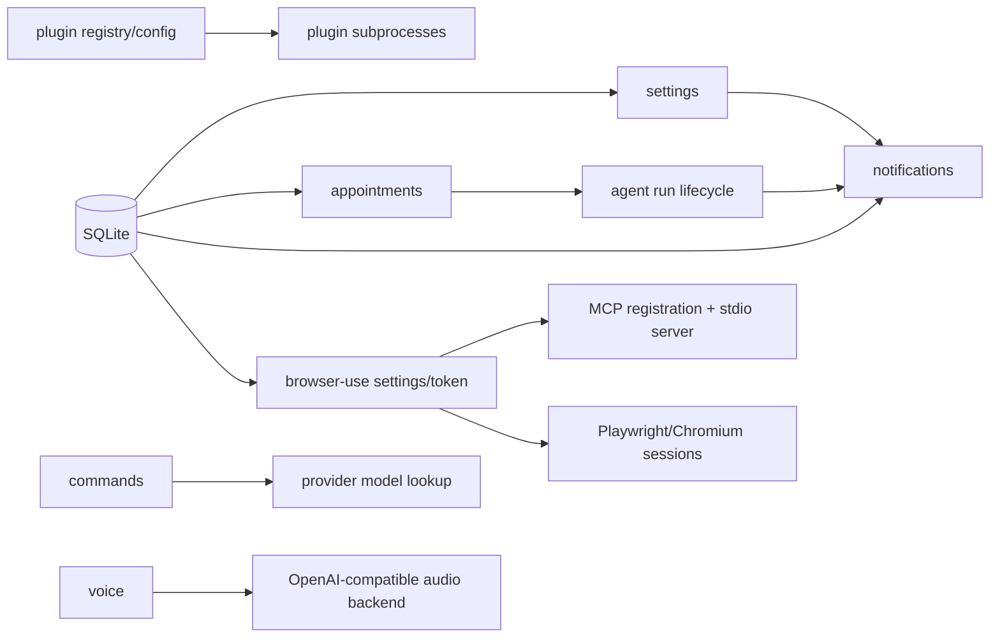

# Backend Persistence, Automation, and Integrations

## Scope and boundaries

This map covers the durable SQLite foundation and the backend modules that persist configuration, schedule work, deliver notifications, discover/execute commands, host plugins, automate a browser, or proxy voice services. Agent/provider execution is adjacent: appointments launch runs through the agent lifecycle, notifications consume run events, commands may resolve provider models, and browser-use registers an MCP server. Read `backend-agent-provider-cli.md` and `backend-realtime-websocket-sessions.md` for those internals rather than expanding them here.

## Architecture at a glance

The database, appointments, settings, and notification repositories are durable. Browser sessions and plugin subprocess registries are process-local; browser settings/token are stored in `app_config`, while plugin enablement/secrets live in `~/.claude-code-ui/plugins.json`.

## 1. Database foundation

| Symbol | Defining path | Role |
|---|---|---|
| `getConnection`, `getDatabasePath`, `closeConnection` | `server/modules/database/connection.ts` | Lazily open/inspect/close the singleton `better-sqlite3` connection. `DATABASE_PATH` wins; a legacy `server/database/auth.db` and its WAL/SHM files can be copied once. |
| `initializeDatabase` | `server/modules/database/init-db.ts` | Applies `INIT_SCHEMA_SQL`, then calls `runMigrations`. |
| `INIT_SCHEMA_SQL` and table constants | `server/modules/database/schema.ts` | Canonical DDL for users, credentials, notifications, projects, sessions, run state/history, appointments, and app configuration. |
| `runMigrations` | `server/modules/database/migrations.ts` | Idempotent compatibility upgrades and data backfills, including project/session hierarchy and appointment queue/run-generation changes. |
| `appointmentsDb` | `server/modules/database/repositories/appointments.db.ts` | Transactional appointment CRUD, queue ordering, claiming, run-generation assignment, and status transitions. |
| `appConfigDb`, `notificationPreferencesDb`, `notificationChannelEndpointsDb`, `pushSubscriptionsDb`, `vapidKeysDb` | `server/modules/database/repositories/*.ts` | Persistence adapters used by browser-use, settings, and notifications. |

`getConnection()` eagerly creates the `app_config` table because auth/config consumers can read it before full initialization. Repositories call the singleton directly and are re-exported by `server/modules/database/index.ts`. When changing persisted shape, update schema for new installs, add an idempotent migration for existing installs, then adjust only the owning repository and focused tests.

## 2. Settings and notification persistence

### Settings

| Symbol | Path | Responsibility |
|---|---|---|
| `settingsRoutes` | `server/modules/settings/settings.module.ts` | Composition root wiring database repositories, notification effects, VAPID access, and Docker management. |
| `createSettingsRouter` | `server/modules/settings/settings.routes.ts` | Routes for Docker actions/logs, API keys, credentials, notification preferences, VAPID public key, and push subscribe/unsubscribe. |
| `createSettingsService` | `server/modules/settings/settings.service.ts` | Validates user-scoped writes, masks listed API keys, persists credentials/preferences/subscriptions, and enables/disables Web Push preference with subscription changes. |
| `createDockerManagementService` | `server/modules/settings/docker-management.service.ts` | Calls configured management endpoints for `build`, `restart`, `down`, and streams logs; isolates credentials/upstream error handling. |

Change API-key/credential behavior in `settings.service.ts` plus the corresponding database repository. Change HTTP shapes in `settings.routes.ts`. Change only the external Docker-control protocol in `docker-management.service.ts`.

### Notifications

| Symbol | Path | Responsibility |
|---|---|---|
| `createNotificationEvent`, `buildNotificationPayload` | `server/modules/notifications/services/notification-orchestrator.service.ts` | Normalize provider/run events and construct channel-neutral payloads. |
| `notifyUserIfEnabled`, `notifyRunStopped`, `notifyTaskCompleted`, `notifyRunFailed` | same | Apply preferences/deduplication and fan out run/task events. |
| `registerDesktopNotificationClient`, `unregisterDesktopNotificationClient`, `sendDesktopNotification` | `server/modules/notifications/services/desktop-notification-clients.service.ts` | Maintain process-local desktop WebSocket clients keyed by user/endpoint and deliver payloads. |
| `handleDesktopNotificationsConnection` | `server/modules/notifications/websocket/desktop-notifications-websocket.service.ts` | Authenticate/register desktop notification sockets and clean them up. |
| `ensureVapidKeys`, `getPublicKey`, `configureWebPush` | `server/modules/notifications/vapid-keys.service.ts` | Persist or load the VAPID pair and configure `web-push`. |
| notifications router | `server/modules/notifications/notifications.routes.ts` | CRUD for durable channel endpoints and associated channel preference. |

Delivery flow: provider/run code creates an event -> `notifyUserIfEnabled` checks durable preferences and a 20-second in-memory dedupe window -> desktop delivery uses registered sockets; Web Push uses durable subscriptions and VAPID configuration. Settings owns browser subscription endpoints; notifications owns event normalization and delivery.

## 3. Scheduled and queued work

| Symbol | Path | Responsibility |
|---|---|---|
| `AppointmentCreateRequest`, `createAppointmentsService`, `appointmentServiceDefaults` | `server/modules/appointments/appointments.service.ts` | Validate project/session ownership and expose list/create/reorder/dispatch/toggle/postpone/cancel workflows. |
| `createAppointmentsRouter` | `server/modules/appointments/appointments.routes.ts` | User/project-scoped appointment HTTP API. |
| `createAppointmentScheduler` | `server/modules/appointments/appointment-scheduler.service.ts` | Poll due, project-idle, and queue work; claim atomically; launch runs; reconcile terminal run state. |
| `appointmentScheduler`, `appointmentsRouter` | `server/modules/appointments/appointments.module.ts` | Compose `appointmentsDb`, session/project repositories, run registry, and `chatRunLifecycleService.start`. |

Lifecycle: a durable row starts as `draft` or `scheduled`; the scheduler prevents conflicting project/session work, atomically `claim`s it to `running`, filters attachment descriptors, calls the agent run lifecycle, and stores the returned generation. Later ticks reconcile that exact generation from `sessionRunStateDb` into `completed` or `failed`. On startup, active project-idle appointments become `needs_review`, avoiding unsafe automatic replay after downtime.

Modify trigger/queue semantics in `appointmentsDb` and `createAppointmentScheduler`; modify authorization/validation in the service/routes; modify actual run execution in the agent map, not here.

## 4. Plugins

| Symbol | Path | Responsibility |
|---|---|---|
| `scanPlugins`, `validateManifest`, `installPluginFromGit`, `updatePluginFromGit`, `uninstallPlugin`, `resolvePluginAssetPath` | `server/modules/plugins/plugin-registry.service.ts` | Discover manifests under `~/.claude-code-ui/plugins`, validate/build Git installs, and safely locate assets. |
| `getPluginsConfig`, `savePluginsConfig` | same | Read/write plugin enablement and secrets in `~/.claude-code-ui/plugins.json`. |
| `createPluginsService` | `server/modules/plugins/plugins.service.ts` | Orchestrate list/manifest/assets, enablement, install/update/uninstall, and lazy RPC startup. |
| `startPluginServer`, `stopPluginServer`, `startEnabledPluginServers`, `stopAllPlugins`, `getPluginPort`, `isPluginRunning` | `server/modules/plugins/plugin-process.service.ts` | Own child-process lifecycle and process-local port registry. Startup requires a JSON `{ ready: true, port }` line within 10 seconds; shutdown escalates from `SIGTERM` to `SIGKILL`. |
| `createPluginsRouter`, `pluginsRoutes` | `server/modules/plugins/plugins.routes.ts`, `plugins.module.ts` | HTTP transport and dependency composition. |

For manifest/install rules use the registry service; for enable/update/RPC workflow use `plugins.service.ts`; for subprocess readiness or shutdown use `plugin-process.service.ts`. Do not mix these layers when changing one concern.

## 5. Commands

`createCommandsRouter` in `server/modules/commands/commands.routes.ts` is the main implementation and `commandsRoutes` in `commands.module.ts` supplies filesystem, process, application-root, home-directory, and provider-model dependencies. `scanCommandsDirectory` recursively discovers Markdown commands and parses front matter; project `.claude/commands` and user `~/.claude/commands` are presented alongside `builtInCommands`. `builtInHandlers` implements `/help`, `/models`, `/cost`, `/memory`, `/config`, and `/status`; `resolveCommandModel` and `executeModelsCommand` isolate model lookup. The `/list` and `/execute` handlers perform discovery, argument substitution, file includes, and command execution.

Add a built-in in `builtInCommands` and `builtInHandlers`; change Markdown command discovery in `scanCommandsDirectory`; change provider-model behavior only in the model helpers/dependency. Focused coverage is `server/modules/commands/tests/commands.test.ts`.

## 6. Browser-use and MCP

| Symbol | Path | Responsibility |
|---|---|---|
| `browserUseService` | `server/modules/browser-use/browser-use.service.ts` | Own settings, runtime installation/readiness, MCP registration, in-memory sessions/handles, Playwright actions, TTL cleanup, and shutdown. |
| `startBrowserUseMcp` | `server/modules/browser-use/index.ts` | Starts the stdio MCP implementation when invoked as that process. |
| `tools`, `callTool`, `handleMessage` | `server/modules/browser-use/browser-use-mcp.ts` | Define MCP tools and translate JSON-RPC/stdio calls into authenticated backend API calls. |
| browser-use routes | `server/modules/browser-use/browser-use.routes.ts` | Status/settings/runtime install/session inspection and stop/delete API. |
| MCP routes | `server/modules/browser-use/browser-use-mcp.routes.ts` | Bearer-token-protected tool dispatch used by the stdio MCP process. |

Settings and the generated MCP token persist through `appConfigDb` keys `browser_use_settings` and `browser_use_mcp_token`; active session metadata and Playwright handles are process-local maps. Enabling calls `registerAgentMcp`, which registers `cloudcli-browser` with all providers through `providerMcpService`; disabling unregisters MCP and stops sessions. Agent tools create a headless (optionally persistent-profile) session and call exact actions such as `agentNavigate`, `agentSnapshot`, `agentClick`, `agentType`, `agentFillForm`, `agentPressKey`, `agentSelectOption`, `agentWaitFor`, and `agentTabs`.

Change browser behavior in `browser-use.service.ts`; tool schemas/JSON-RPC translation in `browser-use-mcp.ts`; API authentication in `browser-use-mcp.routes.ts`; provider-specific MCP mechanics in the provider map.

## 7. Voice

| Symbol | Path | Responsibility |
|---|---|---|
| `createVoiceService` | `server/modules/voice/voice.service.ts` | Validate configured backend/overrides and proxy transcription to `/audio/transcriptions` and speech synthesis to `/audio/speech`. |
| `createVoiceRouter` | `server/modules/voice/voice.routes.ts` | Expose `/health`, multipart `/transcribe`, and streaming `/tts`; translate service failures to HTTP responses. |
| `voiceRoutes` | `server/modules/voice/voice.module.ts` | Compose environment defaults, timeout-aware fetch, Multer in-memory upload limits, service, and router. |

Voice has no database repository: configuration comes from module defaults plus request header overrides, and audio is forwarded rather than persisted. Change outbound backend compatibility in the service, upload/HTTP behavior in the router/module, and keep both covered by `server/modules/voice/tests/voice.service.test.ts`.

## Extension/change-point index

| Goal | Start here | Usually also inspect |
|---|---|---|
| Add/change a SQLite entity | `database/schema.ts`, owning repository | `database/migrations.ts`, repository tests |
| Change push/desktop delivery | `notifications/services/notification-orchestrator.service.ts` | preferences/subscription repositories; WebSocket service for desktop only |
| Add an appointment trigger | `appointments.db.ts`, `appointment-scheduler.service.ts` | shared appointment types and appointment tests |
| Change plugin installation | `plugin-registry.service.ts` | `plugins.service.ts`; process service only if startup changes |
| Add a slash command | `commands.routes.ts` | `commands.test.ts` |
| Add a browser MCP tool | `browser-use-mcp.ts` | MCP route dispatch and `browserUseService` action |
| Change STT/TTS backend | `voice.service.ts` | `voice.routes.ts` only if HTTP input/output changes |

## Focused validation references

- Database: `server/modules/database/tests/appointments.db.test.ts`, `sessions.db.integration.test.ts`, `projects.db.integration.test.ts`, `session-run-state.db.test.ts`.
- Settings: `server/modules/settings/tests/settings.service.test.ts`, `docker-management.service.test.ts`.
- Appointments: `server/modules/appointments/tests/appointment-scheduler.service.test.ts`, `appointments.routes.test.ts`.
- Notifications: `server/modules/notifications/tests/notification-orchestrator.integration.test.ts`.
- Plugins: `server/modules/plugins/tests/plugins.service.test.ts`.
- Commands: `server/modules/commands/tests/commands.test.ts`.
- Browser-use: `server/modules/browser-use/tests/browser-use.service.test.ts`.
- Voice: `server/modules/voice/tests/voice.service.test.ts`.

For documentation-only changes, verify each cited path and symbol directly. For behavior changes, run the narrow test file first, then the repository's backend test command from `package.json` if the change crosses module boundaries.
