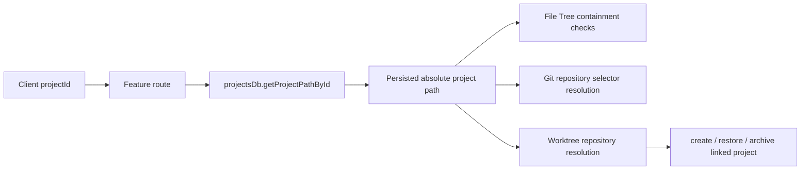

# Backend Workspaces, Files, Git, and Worktrees

## Scope and boundaries

This chapter maps the authenticated workspace/source-control APIs mounted in `server/index.ts`: `/api/projects`, `/api/file-tree`, `/api/git`, and `/api/worktrees`. Projects owns persistent project identity and the project-ID-to-path association; File Tree owns browsing and file mutation; Git owns repository discovery and ordinary source-control commands; Worktrees owns linked-worktree lifecycle and its connection back to project records. Authentication and database internals are adjacent concerns covered by the backend foundations and persistence maps.

## Entry points and composition

| Symbol | Defined in | Role |
|---|---|---|
| default Projects router | `server/modules/projects/projects.routes.ts` | Project listing, creation/cloning, session paging, rename/star, archive/restore, and deletion routes. Exported through `server/modules/projects/index.ts`. |
| `fileTreeRoutes` | `server/modules/file-tree/file-tree.module.ts` | Production File Tree router assembled from filesystem, Projects, workspace-validation, MIME, logging, concurrency, and Multer adapters. |
| `createFileTreeRouter` | `server/modules/file-tree/file-tree.routes.ts` | Transport layer for `/api/file-tree`; parses requests and delegates to `FileTreeServices`. |
| `createFileTreeService` | `server/modules/file-tree/file-tree.service.ts` | Implements workspace browsing and project-scoped filesystem workflows. |
| `createGitModule` | `server/modules/git/git.module.ts` | Injects filesystem, process spawning, project-path lookup, and provider runtimes into `createGitRouter`. |
| `createGitRouter` | `server/modules/git/git.routes.ts` | Large route-owned Git application layer for status, diffs, commits, branches, remotes, and destructive working-tree actions. |
| `GitRepositoryService` | `server/modules/git/git-repository.service.ts` | Safely resolves repository selectors under a project workspace and discovers nested repository roots. |
| `worktreesRoutes` | `server/modules/worktrees/worktrees.module.ts` | Production Worktrees router; the module composes Git, filesystem, and project gateway dependencies. |
| `createWorktreesRouter` | `server/modules/worktrees/worktrees.routes.ts` | Thin parser/delegator for list, create, open, merge, and remove operations. |

All four groups are protected by `authenticateToken`; the API-wide `validateApiKey` middleware runs earlier in `server/index.ts`.

## Project identity and workspace path flow

- `createProject` in `server/modules/projects/services/project-management.service.ts` normalizes the requested path, calls `validateWorkspacePath`, ensures the directory exists, and persists the resolved path. Its API view exposes the database `project_id` as `projectId` and the path as both `path` and `fullPath`.
- `getProjectsWithSessions`, `getArchivedProjectsWithSessions`, and `getProjectSessionsPage` in `projects-with-sessions-fetch.service.ts` are the read side of project identity; Projects routes also expose `updateProjectDisplayName`, `toggleProjectStar`, `deleteOrArchiveProject`, and `restoreArchivedProject`.
- File Tree's injected `FileTreeProjectGateway.getProjectPathById` converts `:projectId` to a root before any project file operation. Callers do not supply an authoritative filesystem root.
- Git receives the ID in the `project` query/body field. `getActualProjectPath` resolves it with the injected database lookup, applies `validateProjectPath`, then asks `GitRepositoryService.resolve` to select the root or a nested repository.
- Worktrees also receives `project`; `worktreeServices.resolveProjectPath` resolves the database path and uses `resolveWorkspaceRelativePath` for an optional `repository` selector. Opening a worktree creates/restores a project row; removing one archives its linked project when present.

## Safety and validation boundaries

| Boundary | Owner and behavior |
|---|---|
| Workspace admission | `validateWorkspacePath` in `server/shared/utils.ts`, called by `createProject`, clone workflows, and the File Tree workspace gateway. It canonicalizes paths, enforces the configured workspace root, and rejects forbidden/system paths and symlink escapes. |
| Project-file containment | `resolvePathInsideProject` in `file-tree.service.ts` resolves relative or absolute input and rejects paths whose `path.relative` escapes the project root. It is used for reads, streams, saves, listings, create/rename/delete, and uploads. `validateFilename` rejects empty, reserved, dot-only, control, and separator-containing names. Project-root deletion is explicitly forbidden. |
| Workspace browser/folder creation | `browseWorkspace` and `createWorkspaceFolder` call the injected workspace `validatePath`; `~` expands only to the configured workspace root. Traversal does not recurse into `FORBIDDEN_WORKSPACE_PATHS`. |
| Upload limits | `file-tree.module.ts` configures Multer disk uploads, a 200 MB per-file limit, and 20-file limit. `storeUploadedFiles` rechecks every destination with `resolvePathInsideProject` and cleans temporary files on failures/escapes. |
| Git project/repository target | `validateProjectPath` rejects missing/NUL/root paths. `resolveWorkspaceRelativePath` (via `GitRepositoryService.resolve`) confines an optional repository selector to the project workspace; initialized selectors must be actual Git work-tree roots. Discovery avoids symlinks and prunes costly generated directories. |
| Git argument validation | Route-local `validateCommitRef`, `validateBranchName`, `validateRemoteName`, and `validateFilePath` constrain refs/names and block file traversal. Git commands use argument arrays rather than shell command construction. |
| Worktree membership | `listWorktreePorcelainEntries` parses Git's authoritative worktree list; `findWorktreeEntryByPath` requires requested worktree paths to match registered entries. `openWorktreeAsProject` therefore cannot register arbitrary directories. Branches pass `validateWorktreeBranchName`; the main worktree cannot be removed or merged into itself. |
| Destructive-work protection | `removeWorktree` refuses dirty worktrees unless forced. `mergeWorktree` requires clean source and target worktrees, aborts/resets failed merges, and reports conflicts. File Tree and Git destructive routes retain their own operation-specific checks. |

## Route and operation map

### Projects (`/api/projects`)

- Discovery: `GET /`, `GET /archived`, `GET /:projectId/sessions`.
- Registration and cloning: `POST /create-project` calls `createProject`; `GET /clone-progress` streams SSE events from `startCloneProject` and cancels the clone when the request closes.
- Metadata/lifecycle: `PUT /:projectId/rename`, `POST /:projectId/toggle-star`, `POST /:projectId/restore`, `DELETE /:projectId` (archive by default, permanent DB/session cleanup with `force=true`), plus `POST /migrate-legacy-stars`.
- Important service symbols: `generateDisplayName`, `getProjectsWithSessions`, `getArchivedProjectsWithSessions`, `getProjectSessionsPage`, `startCloneProject`, `createProject`, `updateProjectDisplayName`, `deleteOrArchiveProject`, `restoreArchivedProject`, `toggleProjectStar`, and `applyLegacyStarredProjectIds`.

### File Tree (`/api/file-tree`)

- Workspace discovery: `GET /browse-filesystem` → `browseWorkspace`; `POST /create-folder` → `createWorkspaceFolder`.
- Read/open/save: `GET /projects/:projectId/file` → `readTextFile`; `GET /projects/:projectId/files/content` → `openFile`; `PUT /projects/:projectId/file` → `saveTextFile`.
- Tree listing: `GET /projects/:projectId/files` → `listProjectFiles` (depth, metadata, `.gitignore` options); `GET .../files/page` → `listProjectFilePage` (bounded paging).
- Mutation: `POST .../files/create` → `createEntry`; `PUT .../files/rename` → `renameEntry`; `DELETE .../files` → `deleteEntry`; `POST .../files/batch` → `batchMutateEntries`; `POST .../files/upload` → `storeUploadedFiles`.
- Batch copy/move/delete resolves every source and destination from the project ID, removes descendants of selected directories, protects the project root, and preflights descendant targets and basename collisions before invoking recursive copy, rename, or delete adapters.
- `buildFileTree` filters common heavy/hidden implementation directories, sorts directories first, optionally reads metadata under a priority-aware concurrency limiter, and optionally applies `createGitignoreEntryFilter`.

### Git (`/api/git`)

| Group | Routes / symbols |
|---|---|
| Repository targeting | `GET /repositories`; `GitRepositoryService.discover`, `GitRepositoryService.resolve`, `getActualProjectPath`, `validateGitRepository`. |
| Working tree | `GET /status`, `POST /init`, `GET /diff`, `GET /file-with-diff`, `POST /discard`, `POST /delete-untracked`. `parseGitStatusOutput` converts porcelain status output. |
| Commit lifecycle | `POST /initial-commit`, `POST /commit`, `POST /stage`, `POST /unstage`, `POST /revert-local-commit`, `GET /commits`, `GET /commit-diff`. `parseGitLogWithStats` parses the custom field-separated log format. |
| Branches | `GET /branches`, `POST /checkout`, `POST /create-branch`, `POST /delete-branch`. |
| Remote synchronization | `GET /remote-status`, `POST /fetch`, `POST /pull`, `POST /push`, `POST /publish`; remote names and targets are validated before process execution. |
| AI assistance | `POST /generate-commit-message` → `generateCommitMessageWithAI`; provider execution is injected by `createGitModule`, while `cleanCommitMessage` normalizes the response. |

`resolveRepositoryFilePath`, `getRepositoryRootPath`, and status-derived candidate paths bridge Git-relative file names to real files for diff/file responses while keeping them under the selected project/repository boundary.

### Worktrees (`/api/worktrees`)

- `GET /` → `listWorktrees`: parses `git worktree list --porcelain`, computes dirty counts, ahead/behind, and last commit data, and attaches `linkedProjectId`/archive status from the Projects database.
- `POST /create` → `createAndOpenWorktree`: `createWorktree` creates a sibling `<repo>-worktrees/<sanitized-branch>` directory, then `openWorktreeAsProject` registers/restores that path. The coordinator removes the new worktree if project opening fails.
- `POST /open` → `openWorktreeAsProject`: verifies membership and connects the worktree path to a CloudCLI project, naming it `repo · branch`.
- `POST /merge` → `mergeWorktree`: merges the linked branch into the main worktree's branch, optionally squash-commits and optionally calls `removeWorktree` afterward.
- `POST /remove` → `removeWorktree`: removes a non-main worktree, optionally deletes its branch, and best-effort archives its linked project.
- Core Git helpers in `worktree-git.service.ts`: `runGitCommand`, `validateWorktreeBranchName`, `parseWorktreeListPorcelain`, `listWorktreePorcelainEntries`, `findWorktreeEntryByPath`, and `countChangedFiles`.

## Key change points

- Add or change project lifecycle behavior in `projects.routes.ts` and the focused service under `projects/services/`; preserve the project ID as the cross-module public identity.
- Add a filesystem operation to `FileTreeServices`/shared types, implement it in `createFileTreeService`, expose it through `createFileTreeRouter`, and wire only required capabilities in `file-tree.module.ts`. Reuse project lookup and `resolvePathInsideProject` rather than accepting arbitrary roots.
- Add a standard Git operation in `createGitRouter`; use `getActualProjectPath`, repository/file/ref validators, and argument-array process execution. Repository discovery/selector semantics belong in `GitRepositoryService`.
- Add a worktree workflow as an independently testable service function, expose it through `WorktreeServices`, compose it in `worktrees.module.ts`, and keep routes limited to parsing. Any path exposed as a selectable workspace should deliberately decide whether to create, restore, archive, or leave untouched a project row.

## Focused tests and validation

- Projects: `server/modules/projects/tests/projects.routes.test.ts`, `project-management.service.test.ts`, `project-clone.service.test.ts`, `projects-with-sessions-fetch.service.test.ts`, and `project-star.service.test.ts`.
- File Tree: `server/modules/file-tree/tests/file-tree.routes.test.ts` and `file-tree.service.test.ts` cover route delegation, containment, errors, paging/concurrency, uploads, and batch mutation preflight/adapter behavior.
- Git: `server/modules/git/tests/git.test.ts`, `git-init.routes.test.ts`, and `git-repository.service.test.ts` cover parsers, initialization, safe selector resolution, and discovery.
- Worktrees: `server/modules/worktrees/tests/worktrees.routes.test.ts` plus focused tests for create, create-and-open, open, list, merge, remove, and Git helpers.
- Shared security boundary: `server/shared/tests/workspace-path-validation.test.ts` validates workspace-root and symlink-escape rejection.

For documentation validation, confirm the four mounts in `server/index.ts`, sample every route group above, and verify named symbols at their cited paths. Run focused backend tests when behavior changes; this map itself changes no runtime code.
