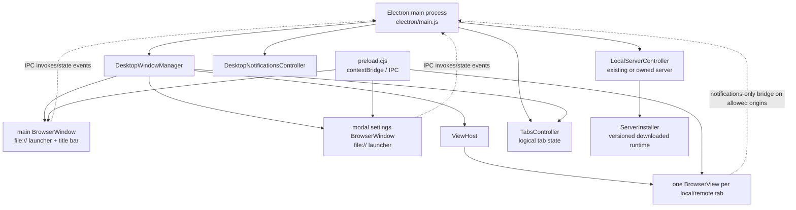

# Electron Desktop Companion Code Map

## Scope and boundaries

This chapter maps the Electron main process, native windows and hosted web-content views, launcher renderer, local-server lifecycle, native notifications, preload bridge, and desktop packaging. It does not document the CloudCLI web application's internal frontend/backend architecture; once a `BrowserView` loads a local or hosted CloudCLI URL, use the relevant frontend, backend, realtime, and contracts maps for behavior inside that application.

## Runtime shape

The launcher remains the main `BrowserWindow` document. Non-launcher tabs are logical records in `TabsController` backed by cached `BrowserView` instances in `ViewHost`; only the active view is attached below the 44-pixel titlebar. The settings surface is a separate transparent child `BrowserWindow` that loads the same launcher files with `modal=1`.

## Primary entry points

| Symbol / entry | Defined in | Role |
|---|---|---|
| `bootstrap()` | `electron/main.js` | Waits for Electron readiness; creates controllers; loads settings/account state; registers protocol, IPC, and app events; creates the desktop window; refreshes cloud environments. |
| `registerSingleInstance()` | `electron/main.js` | Enforces one process and forwards `cloudcli://` callback URLs from later invocations. |
| `createDesktopWindow()` | `electron/main.js` | Dependency-injection composition root for `DesktopWindowManager`; supplies state readers and privileged action callbacks. |
| `registerIpcHandlers()` | `electron/main.js` | Implements the `cloudcli-desktop:*` invoke channels exposed by the preload bridge. |
| `DesktopWindowManager.createWindow()` | `electron/desktopWindow.js` | Creates the main hardened `BrowserWindow`, configures external-window handling and resize/teardown hooks, then loads the launcher. |
| launcher `boot()` / `CC.start()` | `electron/launcher/launcher.js` | Starts the file-based renderer, subscribes to desktop state/commands, and renders launcher, tabs, and settings UI. |
| npm scripts `desktop`, `desktop:dev` | `package.json` | Launch `electron/main.js`; development additionally sets `ELECTRON_DEV_URL`. |

## Important classes, objects, and functions

### Main-process orchestration — `electron/main.js`

- `tabs`: singleton `TabsController`; `activeTarget`, `desktopWindow`, `localServer`, `cloud`, and `desktopNotifications` are the module-level runtime owners.
- `getDesktopState()` is the serialized renderer model: account/auth, active target, desktop settings, local URLs/logs, tabs, environments, and notification state.
- `syncDesktopState()` rebuilds menus, emits state to launcher/settings windows, and refreshes the local startup placeholder while startup logs change.
- `openLocalInDesktop()` creates/activates the pending local tab, shows startup logs, awaits `LocalServerController.getResolvedTarget()`, then loads the resolved URL.
- `openEnvironmentInDesktop(environment)` owns remote tab placeholders, optional environment startup, launch/bootstrap URL selection, and auth-redirect fallback.
- `getEnvironmentTarget()` and `getEnvironmentLaunchTarget()` distinguish the stable remote target URL from a one-use authenticated `loadUrl`.
- `openNotificationTarget()` raises the window, opens or reconstructs the remote target, then navigates the active view to `/session/:sessionId` when supplied.
- `connectCloudAccount()`, `handleDeepLink()`, and `registerProtocolHandler()` implement the `cloudcli://auth/callback` account-connect boundary.
- `registerAppEvents()` coordinates activation, platform window shutdown, notification stop, and owned-local-server detach/shutdown policy.

### Windows and views

| Symbol | Defined in | Responsibility |
|---|---|---|
| `DesktopWindowManager` | `electron/desktopWindow.js` | Owns main/settings windows, tray and application menus, permissions, launcher visibility, and tab/view coordination. |
| `DesktopWindowManager.showLauncher()` | `electron/desktopWindow.js` | Activates the non-closable `home` tab, detaches hosted content, and loads or reuses `launcher/index.html`. |
| `DesktopWindowManager.showTarget()` | `electron/desktopWindow.js` | Upserts tab state, updates the active target/menu/title, delegates content loading, and emits state. |
| `DesktopWindowManager.switchDesktopTab()` / `closeDesktopTab()` | `electron/desktopWindow.js` | Activate/remove logical tabs and attach/destroy their corresponding views. |
| `DesktopWindowManager.ensureSettingsWindow()` | `electron/desktopWindow.js` | Creates/reuses the sandboxed child settings window and loads the launcher with modal query parameters. |
| `DesktopWindowManager.configurePermissions()` | `electron/desktopWindow.js` | Allows only `clipboard-read`, `media`, and `notifications`, and only for localhost HTTP, the control-plane origin, or HTTPS `*.cloudcli.ai`. |
| `ViewHost` | `electron/viewHost.js` | Maps tab IDs to `BrowserView`s, attaches one active view, loads placeholders/content, handles timeout and teardown, and exposes diagnostics. |
| `ViewHost.getOrCreateTabView()` | `electron/viewHost.js` | Creates sandboxed, context-isolated, no-Node-integration views using `preload.cjs`. |
| `ViewHost.showContentTarget()` | `electron/viewHost.js` | Rejects non-HTTP(S) app URLs, loads `loadUrl || url` with `loadUrlWithTimeout()`, and tracks the stable target URL. |
| `ViewHost.showLocalStartupTarget()` / `showTabPlaceholder()` | `electron/viewHost.js` | Render escaped `data:` HTML progress/log views without involving the hosted renderer. |
| `TabsController` | `electron/tabs.js` | Pure logical tab state; IDs are `home`, `local`, or `remote:<environment-id>`. |

External `window.open` requests from the launcher, settings window, and hosted views are denied in Electron and passed to `openExternalUrl()` instead. `ViewHost.readLocalStorageValueForOrigin()` is a privileged main-process helper used only to recover a matching hosted origin's `auth-token` for notification authentication.

### Local server and installation

| Symbol | Defined in | Responsibility |
|---|---|---|
| `LocalServerController` | `electron/localServer.js` | Discovers, starts, monitors, exposes, and shuts down the local CloudCLI backend; persists desktop settings and startup logs. |
| `resolveLocalServerUrl()` | `electron/localServer.js` | Selects development, existing-server, or owned-server startup paths and verifies `/health`. |
| `resolveServerEntry()` | `electron/localServer.js` | Uses `ELECTRON_SERVER_ENTRY`, bundled `dist-server/server/index.js`, or `ServerInstaller.ensureInstalled()`. |
| `startBundledServer()` | `electron/localServer.js` | Spawns the entry detached with `HOST`, `SERVER_PORT`, normalized `PATH`, and packaged Electron-as-Node when applicable. |
| `ensureLocalServer()` / `getResolvedTarget()` | `electron/localServer.js` | Memoize readiness and expose the local desktop target. |
| `getExistingServerCandidateUrls()` | `electron/localServer.js` | Collects configured URLs/ports, `~/.cloudcli/local-server.json`, and the default port before startup. |
| `ServerInstaller` | `electron/serverInstaller.js` | Caches platform/architecture/version-specific server bundles under `~/.cloudcli/server/<version>`. |
| `ServerInstaller.ensureInstalled()` | `electron/serverInstaller.js` | Downloads, SHA-256 verifies, archive-validates, extracts, marks, and returns the server entry. |

The health contract is navigationally important: `isCloudCliServer()` accepts `/health` only when it returns `status: "ok"` plus a string `installMode`, preventing reuse of an unrelated listener.

### Native notifications — `electron/desktopNotifications.js`

- `DesktopNotificationsController` persists `{ enabled }`, keeps one WebSocket connection per running environment, and reports connection/error state through `getState()`.
- `sync()` reconciles connections against `getRunningEnvironmentUrls()` and requires native `Notification` support plus a cloud account device ID.
- `connect()` authenticates, opens `/desktop-notifications`, calls `registerTarget()`, sends a `register` frame, handles notification frames, and schedules exponential reconnects.
- `registerTarget()` registers the desktop endpoint at `/api/notifications/endpoints/current`; `disableCurrentTargets()` disables it when notifications are turned off.
- `getTargetAuthHeaders()` combines the cloud API key with a Bearer token read from the matching hosted view's local storage when available.
- `showNativeNotification()` creates Electron's `Notification`; clicking delegates to `openNotificationTarget()` in `main.js`.

### Preload security boundary — `electron/preload.cjs`

All windows/views are created with `contextIsolation: true`, `nodeIntegration: false`, `sandbox: true`. The preload exposes fixed wrappers rather than `ipcRenderer` itself:

- `window.cloudcliDesktop` is exposed **only** to `file:` launcher/settings documents. It wraps the privileged launcher IPC operations (open/switch/close targets, cloud connection, settings, diagnostics, and menus) and state/command subscriptions.
- `window.cloudcliDesktopNotifications` is exposed to `file:`, localhost HTTP, `cloudcli.ai`, and HTTPS subdomains of `cloudcli.ai`. It provides only notification state, settings update, and state subscription.
- `isCloudCliAppOrigin()` is the origin gate. New renderer privileges require coordinated changes here and in `registerIpcHandlers()`; do not expose generic IPC or Node APIs.

The preload origin gate and `DesktopWindowManager.configurePermissions()` are separate controls: the former governs bridge availability, while the latter governs Electron web permissions.

## Navigational startup traces

### Local workspace

1. Launcher action `CC.act('local')` calls `window.cloudcliDesktop.openLocal()` (`electron/launcher/launcher.js` → `electron/preload.cjs`).
2. IPC `cloudcli-desktop:open-local` invokes `openLocalInDesktop()` (`electron/main.js`).
3. A `local` tab and `BrowserView` show `LocalServerController.getPendingTarget()` plus startup logs.
4. `getResolvedTarget()` → `ensureLocalServer()` → `resolveLocalServerUrl()` checks, in order: `ELECTRON_DEV_URL`; healthy configured/marker/default servers unless forced; then a resolved server entry and newly selected port.
5. `resolveServerEntry()` chooses an override, bundled server, or `ServerInstaller.ensureInstalled()`; `startBundledServer()` spawns it and waits for the health contract.
6. `DesktopWindowManager.showTarget()` → `ViewHost.showContentTarget()` replaces the startup placeholder with the local URL.
7. On quit, `registerAppEvents()` either detaches the owned child when `keepLocalServerRunning` is true or calls `shutdownOwnedServer()`.

### Remote workspace

1. Launcher `CC.openEnv(id)` calls `openEnvironment(id)` through the preload and IPC bridge.
2. `openEnvironmentInDesktop()` creates a `remote:<id>` placeholder tab. If needed, it confirms and calls `cloud.startEnvironmentAndWait()`.
3. The normal target is `cloud.getEnvironmentUrl(environment)`. Without an existing CloudCLI web-session cookie, `getEnvironmentLaunchTarget()` supplies an authenticated one-use `loadUrl`.
4. `DesktopWindowManager.showTarget()` records the target and `ViewHost.showContentTarget()` loads it into that tab's cached `BrowserView`.
5. If a direct load lands on the control-plane login/auth route, the function retries with a forced bootstrap launch URL.

Remote IDE and shell extensions branch from `runActiveEnvironmentAction()`: `openEnvironmentInIde()` builds VS Code/Cursor Remote SSH URIs, while `openEnvironmentInSsh()` opens macOS Terminal or copies the command elsewhere.

## Launcher, packaging, and extension points

| Change area | Primary locations | Notes |
|---|---|---|
| Launcher UI/action | `electron/launcher/launcher.js`, `electron/launcher/launcher.css`, `electron/preload.cjs`, `electron/main.js` | `CC.register()` swaps the body renderer; a privileged action also needs a narrow preload wrapper and matching IPC handler. |
| New target/tab kind | `electron/tabs.js`, `electron/main.js`, `electron/desktopWindow.js`, `electron/viewHost.js` | Define stable tab identity, target creation/startup, and HTTP(S) loading behavior. |
| Window/menu/tray behavior | `electron/desktopWindow.js` | `buildAppMenu()`, `buildTrayMenu()`, `createWindow()`, and `ensureSettingsWindow()` are the main seams. |
| Local discovery/runtime | `electron/localServer.js` | Environment overrides, candidate discovery, host/port choice, runtime selection, spawn environment, and quit ownership live here. |
| Downloaded server release | `electron/serverInstaller.js`, optional `electron/server-bundle-config.json`, release pipeline | Bundle name is `cloudcli-local-server-<version>-<platform>-<arch>.tar.gz`; preserve HTTPS/localhost URL checks, checksum verification, and archive traversal validation. |
| Native notifications | `electron/desktopNotifications.js`, `electron/main.js`, backend notification endpoints | Coordinate endpoint/WebSocket protocol changes with the backend notification subsystem. |
| Packaging | `package.json`, `scripts/release/prepare-desktop-app.js` | `desktop:stage` builds a thin `.desktop-build/desktop-app` containing Electron/public/dist plus `ws`; `electron-builder` uses `electron/main.js`, protocol registration, icons, DMG/NSIS targets, and `asar: false`. |
| Deep links | `electron/main.js`, `package.json` build protocols | Keep `CALLBACK_PROTOCOL`, packaged protocol metadata, single-instance forwarding, and callback validation aligned. |

`electron/server-bundle-config.json` is optional at runtime: `readServerBundleConfig()` falls back to an empty release tag, after which `ServerInstaller` defaults to `v<appVersion>`.

## Important files

- `electron/main.js` — desktop composition root and privileged orchestration.
- `electron/desktopWindow.js` — windows, menus/tray, permissions, and view coordination.
- `electron/viewHost.js` — `BrowserView` lifecycle and guarded URL loading.
- `electron/tabs.js` — logical desktop tab model.
- `electron/localServer.js` — local-server discovery, startup, settings, and ownership.
- `electron/serverInstaller.js` — downloaded local-server integrity and installation.
- `electron/desktopNotifications.js` — native notification endpoint/WebSocket lifecycle.
- `electron/preload.cjs` — renderer-to-main capability boundary.
- `electron/launcher/index.html`, `launcher.js`, `launcher.css` — file-based launcher and settings renderer.
- `package.json`, `scripts/release/prepare-desktop-app.js` — launch scripts and packaged-app staging/build boundaries.

## Focused validation

There are no Electron-focused test/spec files under `electron/`. For documentation or desktop changes:

1. Verify cited symbols directly in the files above and manually trace both startup paths described here.
2. Run `npm run desktop:dev` with the development backend/frontend available to exercise launcher, local startup, tab/view switching, and bridge behavior.
3. Run `npm run desktop:stage` after a production build to validate thin-app staging; use `npm run desktop:pack` for an unpacked electron-builder package when packaging changes.
4. For local-server download changes, exercise `ServerInstaller.ensureInstalled()` against a controlled bundle and confirm checksum failure and unsafe archive entries remain rejected.
