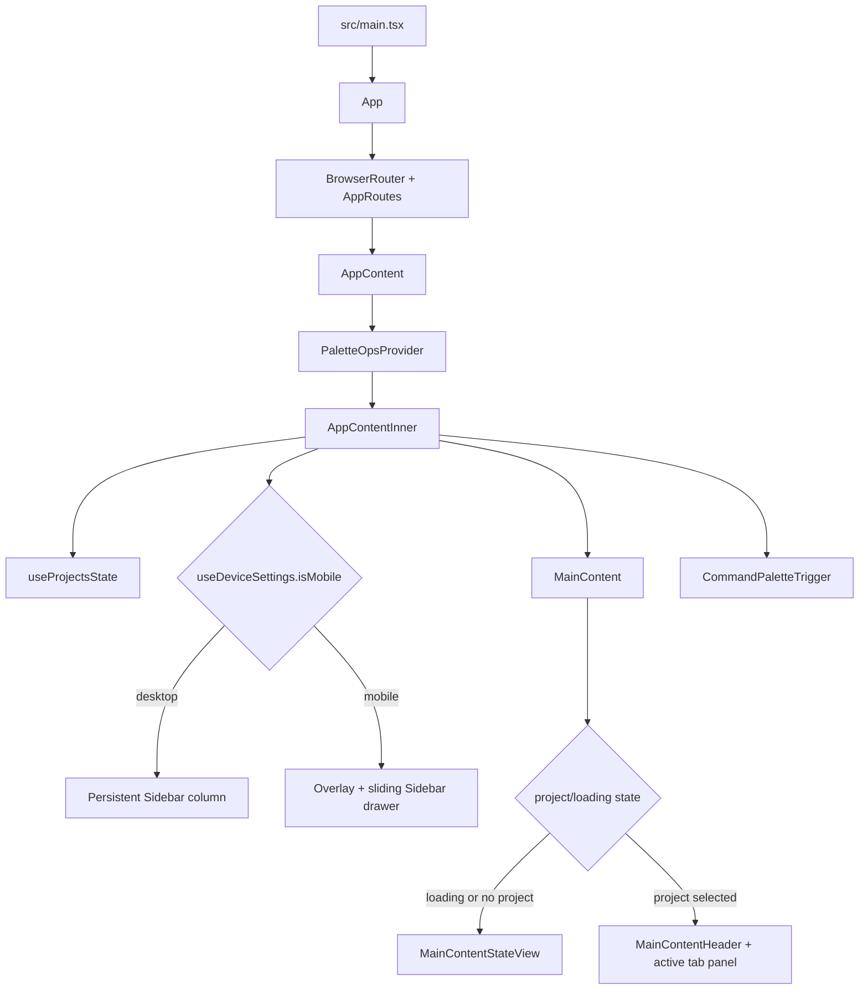
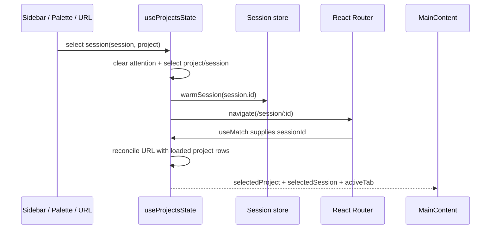

# Frontend Application Shell and Navigation

## Scope and boundaries

This map covers the browser bootstrap, provider/router composition, responsive shell, project/session navigation state, main surface selection, sidebar, and command palette. Feature internals rendered inside the shell (chat state, files/editor, Git, terminal, settings/plugins, and PWA lifecycle) belong in their dedicated maps; this chapter identifies only their shell-facing integration points.

## Entry points and provider composition

| Symbol | Path | Role |
|---|---|---|
| `App` | `src/App.tsx` | Composes global error handling and providers, detects the router basename, and mounts routed protected content. |
| `detectRouterBasename` / `inferRouterBasename` | `src/App.tsx`, `src/routerBasename.ts` | Resolves an authoritative explicit prefix, otherwise prefers manifest/generated-module deployment metadata over icon fallbacks while excluding static-asset directories. |
| `AppRoutes` | `src/App.tsx` | Calls `useRoutes(appRoutes)` and records protected-shell readiness. |
| `AuthLifecycleBoundary` | `src/App.tsx` | Records when authentication loading finishes. |
| `appRoutes` | `src/appRoutes.tsx` | Declares the root, session, and project-draft URLs under `AppContent`. |
| `AppContent` / `AppContentInner` | `src/components/app/AppContent.tsx` | Own the application shell, route-to-state inputs, activity synchronization, responsive sidebar, main content, and global triggers. |

`src/main.tsx` installs console/performance diagnostics, starts PWA registration and i18n initialization, then renders `<App i18n={i18n} />` inside `React.StrictMode`. Performance initialization also installs `window.cloudcliPerformance.capture()` and typed latest-report access. An explicit capture runs one bounded sampler, emits one delimited versioned report through `console.info`, and records privacy-safe main-thread/frame proxies, WebGL capabilities, memory/DOM/resources, and retained Web Vital/lifecycle evidence. It normalizes routes, labels unsupported or privacy-reduced facts, never claims system CPU/GPU utilization, shares concurrent requests, and cleans up temporary observers, timers, animation frames, and WebGL context.

Provider order in `App` is significant:

```text
ErrorBoundary
└─ I18nextProvider
   └─ ThemeProvider
      └─ AuthProvider
         ├─ AuthLifecycleBoundary
         └─ ReloadSafetyProvider
            └─ WebSocketProvider
               └─ ProtectedRoute
                   └─ PluginsProvider
                      └─ SessionStoreProvider
                         ├─ SessionMessageCacheCoordinator
                         └─ BrowserRouter → AppRoutes
```

The router lives inside providers needed by protected application surfaces. `appRoutes` uses empty child elements because URL parameters are consumed by `AppContentInner` through `useMatch`; the visible layout is selected by application state rather than a nested `<Outlet>`.

Basename inference treats runtime `window.__ROUTER_BASENAME__` configuration as authoritative. Without it, manifest and generated `/assets/` module URLs establish the deployment root before icon metadata is considered, so a route-relative Apple touch icon on `/session/:sessionId` cannot incorrectly turn `/session` into the basename. Root deep links therefore retain an empty basename, while metadata rooted at `/ai/` produces `/ai`; both resolve the canonical `/session/:sessionId` route.

## Shell and layout flow



`AppContentInner` lazy-loads `Sidebar`, `MainContent`, `CommandPaletteTrigger`, and quick settings. Desktop navigation is a fixed-width bordered column. Mobile navigation is a modal drawer controlled by `sidebarOpen`; backdrop/menu actions close or open it. `MainContent` preserves the chat surface after first invocation, passes `isActive={activeTab === 'chat'}` so hidden chat streaming can coalesce without React/cache churn, conditionally mounts other tab panels, and can place `EditorSidebar` beside or over the active surface.

### Main-content symbols

| Symbol | Path | Role |
|---|---|---|
| `MainContent` | `src/components/main-content/view/MainContent.tsx` | Selects loading/empty states and renders chat, files, shell, Git, browser, docs, or `plugin:*` panels. |
| `MainContentHeader` | `src/components/main-content/view/subcomponents/MainContentHeader.tsx` | Presents project/session title, tab switching, mobile menu, and soft reload. |
| `MainContentStateView` | `src/components/main-content/view/subcomponents/MainContentStateView.tsx` | Provides shell states before a project surface is available. |
| `useFileOpenResolver` | `src/hooks/useFileOpenResolver.ts` | Resolves chat/palette file references before opening the editor. |
| `useEditorSidebar` | `src/components/code-editor/hooks/useEditorSidebar.ts` | Controls the shell-adjacent editor panel, width, and expansion. |

The built-in `AppTab` values accepted by project state are `chat`, `files`, `shell`, `git`, `browser`, and `docs`; IDs beginning with `plugin:` are also valid. The active tab is restored from and persisted to `localStorage` (`activeTab`). Browser availability is settings-driven, and a disabled browser surface redirects to chat.

## Project and session selection

### State and helper symbols

| Symbol | Path | Role |
|---|---|---|
| `useProjectsState` | `src/hooks/useProjectsState.ts` | Central shell hook for projects, selected project/session, active tab, sidebar/settings visibility, loading, realtime sidebar deltas, and navigation handlers. |
| `applySessionSelectionIntent` | `src/hooks/useProjectsState.ts` | Orders session selection: clear attention, warm cache, select project/session, show chat if needed, navigate, then optionally close mobile navigation. |
| `applyNewSessionIntent` | `src/hooks/useProjectsState.ts` | Selects a project, clears the session, shows chat, emits a reset trigger, navigates to its draft URL, and optionally closes the sidebar. |
| `getProjectDraftUrl` | `src/hooks/useProjectsState.ts` | Builds `/project/:projectId/new` with an encoded project ID. |
| `resolveProjectRoute` | `src/hooks/useProjectsState.ts` | Resolves a project-draft route against loaded projects. |
| `getProjectSessions` | `src/hooks/projectStateUtils.ts` | Normalizes an optional project session array. |
| `mergeExpandedSessionPages` / `mergeProjectSessionPage` | `src/hooks/projectStateUtils.ts` | Preserve already-expanded rows while refreshing or paginating project data. |
| `upsertSessionIntoProject` | `src/hooks/projectStateUtils.ts` | Applies a canonical `session_upserted` delta and maintains session metadata. |
| `mergeRunningSnapshotsIntoProjects` | `src/hooks/projectStateUtils.ts` | Hydrates running/lifecycle session context without advancing pagination cursors. |
| `sessionHistoryRevision` / `shouldSignalExternalHistoryRefresh` | `src/hooks/projectStateUtils.ts` | Decide whether an external session update should refresh the visible transcript. |

### Selection flow



- Initial project data comes from bounded account-specific offline navigation, then `GET /api/projects` through `KeyedServerState`; refreshes retain expanded/paginated rows.
- `/project/:projectId/new` selects the matching loaded project and clears the selected session. A new-session action increments `newSessionTrigger`, ensuring chat-local draft/session state resets even if other state updates are idempotent.
- `/session/:sessionId` first resolves against loaded project rows. For paginated/deep-linked sessions, `api.sessionDetails` resolves canonical session ID and owning project; the hook may synthesize a minimal project for an unloaded/archived owner.
- `session_upserted` WebSocket events update project rows and the selected row without replacing unrelated navigation state. Running/lifecycle snapshots are separately merged into the same sidebar model.
- `handleProjectSelect` clears the session and navigates to `/`. `handleSessionSelect` navigates to `/session/:id`; `handleNewSession` navigates to `/project/:projectId/new`. Mobile handlers close the drawer where appropriate.

## Sidebar navigation

| Symbol | Path | Role |
|---|---|---|
| `Sidebar` | `src/components/sidebar/view/Sidebar.tsx` | Connects shell props to controller state and composes collapsed, content, and modal surfaces. |
| `useSidebarController` | `src/components/sidebar/hooks/useSidebarController.ts` | Coordinates expansion, search, archive views, selection mode, rename/delete, starring, pagination, and collapsed state. |
| `SidebarContent` | `src/components/sidebar/view/subcomponents/SidebarContent.tsx` | Renders expanded navigation, search/filter controls, project/session lists, archive views, and footer actions. |
| `SidebarProjectList` / `SidebarProjectItem` / `SidebarProjectSessions` | `src/components/sidebar/view/subcomponents/` | Render project hierarchy and dispatch project, session, new-session, and pagination intents. |
| `SidebarSessionItem` | `src/components/sidebar/view/subcomponents/SidebarSessionItem.tsx` | Represents a session row, including activity/lifecycle and attention state. |
| `SidebarCollapsed` | `src/components/sidebar/view/subcomponents/SidebarCollapsed.tsx` | Minimal desktop navigation when `useUiPreferences().sidebarVisible` is false. |
| `SidebarModals` | `src/components/sidebar/view/subcomponents/SidebarModals.tsx` | Hosts settings, project creation, and deletion confirmations. |

The sidebar's controller handles navigation UI behavior, while `useProjectsState` remains the owner of shell selection and URL transitions. `sidebarSharedProps` is the explicit adapter between those layers.

## Global command palette

| Symbol | Path | Role |
|---|---|---|
| `CommandPaletteTrigger` | `src/components/command-palette/CommandPaletteTrigger.tsx` | Listens for `isCommandPaletteShortcut`, then lazy-mounts/toggles the palette. |
| `CommandPalette` | `src/components/command-palette/CommandPalette.tsx` | Provides actions, tab navigation, settings links, session/message search, files, commits, branches, and Git actions. |
| `usePaletteOpsRegister` | `src/contexts/paletteOps.ts` | Lets `AppContentInner` register settings/project refresh and `MainContent` register file-opening operations. |
| `useSessionsSource`, `useSessionMessageSearch`, `useFilesSource`, `useCommitsSource`, `useBranchesSource`, `useGitActions` | `src/components/command-palette/sources/` | Supply project-scoped searchable rows and actions. |

The palette receives the selected project and shell callbacks from `AppContentInner`. Session results navigate directly to `/session/:id`; tab actions call `setActiveTab`; file actions cross the `PaletteOpsProvider` boundary to `MainContent`.

## Extension and change points

- **New top-level route:** add a `RouteObject` in `appRoutes`, then consume its match/parameters in `AppContentInner` or introduce a real routed child surface if it should not share state-driven `MainContent` composition.
- **New built-in tab:** extend `AppTab`, `VALID_TABS` in `useProjectsState`, header/tab-switcher UI, and the conditional panel in `MainContent`; add a command-palette navigation row if globally discoverable.
- **Plugin top-level surface:** use the existing `plugin:<name>` tab convention and `PluginTabContent`; plugin registration details belong in `frontend-settings-plugins-onboarding.md`.
- **New global command:** add the item/source in `components/command-palette`; register cross-surface imperative operations through `PaletteOpsProvider` instead of tightly coupling the palette to a feature component.
- **New project/session navigation behavior:** keep URL/selection transitions in `useProjectsState` and UI-only hierarchy/search behavior in `useSidebarController`; update intent tests when ordering changes.
- **Responsive shell changes:** modify the desktop/mobile branch in `AppContentInner` and the menu/header entry points, preserving backdrop dismissal and `sidebarOpen` ownership.

## Important files

- `src/main.tsx`, `src/App.tsx`, `src/appRoutes.tsx`
- `src/components/app/AppContent.tsx`
- `src/components/main-content/view/MainContent.tsx` and `src/components/main-content/view/subcomponents/`
- `src/components/sidebar/view/`, `src/components/sidebar/hooks/useSidebarController.ts`
- `src/components/command-palette/`
- `src/hooks/useProjectsState.ts`, `src/hooks/projectStateUtils.ts`
- `src/contexts/PaletteOpsContext.tsx`, `src/contexts/paletteOps.ts`

## Focused validation and tests

- Symbol/path review: inspect the files listed above and confirm every table entry at its cited definition.
- Bootstrap trace: `src/main.tsx` → `App` provider tree → `AppRoutes`/`appRoutes` → `AppContentInner` → `MainContent`.
- Selection trace: sidebar `onSessionSelect` → `useProjectsState.handleSessionSelect`/`applySessionSelectionIntent` → route reconciliation effect → `MainContent` props.
- Run focused state tests: `node --import tsx --test src/hooks/useProjectsState.newSession.test.ts src/hooks/projectStateSidebar.integration.test.tsx src/hooks/projectStateUtils.test.ts`.
- Relevant UI coverage includes `src/components/sidebar/view/subcomponents/SidebarProjectSessions.test.tsx`, `src/components/main-content/view/subcomponents/MainContentHeader.test.tsx`, and `src/components/main-content/view/startupBoundaries.test.ts`.
