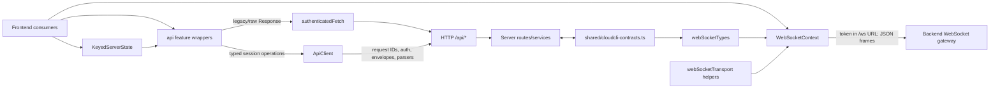

# Shared Contracts, API, and Transport

## Scope and boundaries

This map covers the typed seams between browser and server: dependency-free shared payload validation, the frontend HTTP engines and compatibility wrappers, bearer-token lifecycle, keyed remote-state ownership, and frontend WebSocket transport types/helpers. Backend WebSocket routing belongs in [Backend realtime WebSocket sessions](./backend-realtime-websocket-sessions.md); message reconciliation and cached session state belong in [Frontend chat and session state](./frontend-chat-session-state.md).

The boundary is intentionally uneven while migration is in progress: session/history/lifecycle operations use strict shared parsers through `ApiClient`, while many feature endpoints still return raw `Response` objects through the broad, `@ts-nocheck` compatibility object in `src/utils/api.ts`.

## Boundary overview

## Shared contract surface

All symbols below are defined in `shared/cloudcli-contracts.ts`, which has no browser- or server-only dependencies.

| Category | Important exports | Role and consumers |
|---|---|---|
| Versioning and parse results | `CLOUDCLI_PROTOCOL_VERSION`, `CloudCliProtocolVersion`, `ContractFailureCode`, `ContractParseFailure`, `ContractParseSuccess`, `ContractParseResult` | Establish protocol version `1` and deterministic parser failures (`code`, `path`, `message`). Frontend `ApiClient`, backend provider/WebSocket code, and contract tests consume this vocabulary. |
| HTTP envelopes | `ApiSuccessEnvelope<TData>`, `ApiErrorEnvelope`, `parseApiSuccessEnvelope`, `parseApiErrorEnvelope` | Canonical success/error JSON shapes. `ApiClient.request` validates both success and error paths and converts failures to `ApiError`. |
| Messages and history | `MessageKind`, `ResponseMetadata`, `NormalizedMessage`, `SessionHistoryPayload`, `SessionHistoryEnvelope`, `SessionHistoryEnvelopeStructure`, `parseNormalizedMessage`, `parseSessionHistoryEnvelopeStructure`, `validateSessionHistoryMessageChunk`, `parseSessionHistoryEnvelope` | Provider-neutral persisted/realtime messages and versioned history. `src/utils/sessionHistoryValidation.ts` supplies asynchronous history validation to `ApiClient`; backend provider routes stamp `CLOUDCLI_PROTOCOL_VERSION`. |
| Mutations | `SessionStartMutationResult`, `SessionRenameMutationResult`, `SessionRevisionConflictDetails`, `parseSessionStartMutationResult`, `parseSessionRenameMutationResult` | Canonical start/rename results and revision-conflict detail. Used by `ApiClient.startSession`/`renameSession` and backend `session-mutations.service.ts`. |
| Lifecycle snapshots | `SessionLifecycleStatus`, `SessionRunTerminalReason`, `SessionLifecycleContext`, `SessionLifecycleSnapshot`, `RunningSessionSnapshot`, `parseSessionLifecycleSnapshot`, `parseRunningSessionSnapshot` | Shared shape for running/status HTTP responses. Backend re-exports/uses the types through `server/shared/types.ts`; frontend validates arrays before returning them. |
| Realtime protocol | `ChatSubscriptionCursor`, `ChatSubscribeCommand`, `ChatSubscribedEvent`, `SequencedChatEvent`, `parseChatSubscribeCommand`, `parseChatSubscribedEvent`, `parseSequencedChatEvent` | Versioned subscription cursor, acknowledgement/replay metadata, and sequenced event frames. Backend `chat-websocket.service.ts` uses the protocol version; frontend transport types incorporate acknowledgement and sequenced-event types. |

Parsers validate only their declared stable fields. `NormalizedMessage` deliberately permits extra provider-neutral fields through its index signature, so adding semantics to an optional field still requires consumer review even when old parsers accept the payload.

## HTTP client layers

### Typed engine: `src/utils/apiClient.ts`

| Symbol | Role |
|---|---|
| `ApiErrorCode`, `ApiError` | Normalizes abort, timeout, network, contract, HTTP, and server-defined errors; preserves status, request ID, retryability, details, and cause. |
| `RequestOptions` | Caller cancellation/timeout, request correlation, idempotency, and retry controls. |
| `SessionHistoryResult` | Discriminates an ETag-backed `304` from a validated canonical history body. |
| `ApiClient` | Injectible `fetch`-based engine. Its private `request` adds `X-Request-ID`, optional `Idempotency-Key`, JSON encoding, auth, timeout, diagnostics, safe-read retries, envelope parsing, and error normalization. |
| `ApiClient.sessionHistory` | Uses `no-store`; supports `If-None-Match`, ETag revision recovery, and asynchronous message validation. |
| `ApiClient.runningSessions`, `sessionLifecycleStatus` | Validate success envelopes and each shared snapshot in returned `sessions` arrays. |
| `ApiClient.startSession`, `renameSession`, `deleteSession` | Typed session mutations; writes are not automatically retried. |
| `apiClient` | Shared default `ApiClient` instance used by feature wrappers and session state. |

HTTP success flow: feature call -> `ApiClient.request` -> headers/body/fetch -> `parseApiSuccessEnvelope` plus a data parser -> typed value. Invalid JSON or a rejected contract becomes `ApiError(code: 'CONTRACT_ERROR')`; a valid `ApiErrorEnvelope` supplies server `code`, `message`, `details`, `retryable`, and optional `requestId`. GET/HEAD requests retry once for transport failures or configured transient statuses; mutations require caller-controlled idempotency and do not retry automatically.

### Compatibility/feature layer: `src/utils/api.ts`

- `authenticatedFetch` adds JSON content type except for `FormData`, adds bearer auth outside platform mode, and handles auth refresh/expiration response headers. It returns the raw `Response`; callers remain responsible for status handling, JSON parsing, and endpoint-specific validation.
- `api` groups auth, project/session, appointment, file-tree, user, and generic endpoint wrappers. The migrated `deleteSession`, `runningSessions`, `sessionLifecycleStatus`, `startSession`, and `renameSession` entries delegate to `apiClient`; most other entries still delegate to `authenticatedFetch`.
- `buildFileTreeQuery`, `buildFileTreeUrl`, and `buildFileTreePageUrl` centralize file-tree URL/query construction. Their workspace semantics are documented in the workspace-tools maps, not here.
- `api.ts` re-exports `authToken.ts`, which is why consumers such as `WebSocketContext.tsx` import auth helpers through `../utils/api`.

When moving an endpoint from `authenticatedFetch` to `ApiClient`, add a response contract/parser first, preserve the wrapper's externally observed return shape, and update callers that previously parsed `Response` themselves.

## Authentication participation

`src/utils/authToken.ts` owns browser token persistence and events:

| Export | Behavior |
|---|---|
| `AUTH_TOKEN_REFRESHED_EVENT`, `AUTH_SESSION_EXPIRED_EVENT` | Window event names for auth lifecycle observers. |
| `isValidRefreshedToken` | Accepts a three-segment JWT-like token before storage. |
| `isAuthTokenExpired`, `getAuthTokenRefreshDelay` | Decode numeric `iat`/`exp`; detect expiry and calculate the halfway refresh point. |
| `getStoredAuthToken` | Reads `localStorage['auth-token']`, expiring and removing a token whose parsed `exp` has passed. |
| `storeAuthToken` | Validates, persists, and dispatches `AUTH_TOKEN_REFRESHED_EVENT`. |
| `expireAuthSession` | Removes the token and dispatches `AUTH_SESSION_EXPIRED_EVENT`. |

Both HTTP engines send `Authorization: Bearer <token>` only outside `IS_PLATFORM`. Both consume `X-Refreshed-Token` and `X-Auth-Error`. WebSocket auth is adjacent but distinct: `WebSocketContext.tsx` waits for auth state, rejects expired tokens, and in OSS mode connects to `/ws?token=<encoded token>`; platform mode connects to `/ws` through the same-origin proxy without requiring the browser token.

## Server-state participation

`src/lib/serverState.ts` does not define API schemas; it is the reusable owner for discovery/loading state around API calls.

- `ServerStateStatus`, `ServerStateSnapshot<T>`, and `ServerStateReadOptions` describe observable value/error/loading/freshness state.
- `KeyedServerState<K,T>` deduplicates in-flight reads per key, serves fresh cached values for a configured stale time, aborts superseded forced reads, rejects stale generations, publishes subscriptions, and supports `invalidate`, optimistic/local `patch`, `cancel`, and `dispose`.
- Confirmed consumers include project discovery in `useProjectsState.ts`, plugin discovery in `PluginsContext.tsx`, activity synchronization in `components/app/sessionActivitySync.ts`, and session-history ownership in `useSessionStore.ts` (`apiClient.sessionHistory`). Thus contract errors surface as server-state errors, while cancellation avoids publishing an obsolete result.

See [Frontend chat and session state](./frontend-chat-session-state.md) for history caching/reconciliation and the frontend shell map for project selection; this map owns only the generic remote-state boundary.

## WebSocket frontend boundary

### Types: `src/contexts/webSocketTypes.ts`

- `LegacyServerEvent` preserves the wider existing gateway event set while migration to shared contracts proceeds.
- `ServerEvent` admits shared `ChatSubscribedEvent` and `SequencedChatEvent` plus legacy frames; it is not runtime validation by itself.
- `ServerEventListener`, `ServerEventGuard`, and overloaded `SubscribeToServerEvents` define unfiltered or guard-narrowed subscriptions.
- `WebSocketTransportState` is `idle | connecting | connected | replaying | degraded | offline`.
- `WebSocketReconnectEvent` is a client-generated reconnect notification.
- `isChatServerEvent` and `isWebSocketReconnectEvent` are lightweight narrowing guards.
- `WebSocketContextType` exposes the socket, `sendMessage`, `subscribe`, connectivity epoch, and transport state.

### Lifecycle helpers: `src/contexts/webSocketTransport.ts`

`RetryPolicy`, `DEFAULT_WEBSOCKET_RETRY_POLICY`, `getWebSocketRetryDelay`, `shouldRetryWebSocketClose`, `shouldArmWebSocketReload`, and `isCurrentWebSocketLifecycle` keep reconnect/backoff/stale-callback policy pure and testable. `getWebSocketTransportState` derives user-visible connection state.

`WebSocketContext.tsx` is the principal consumer: it creates the authenticated URL, parses incoming JSON, dispatches `ServerEvent` values, serializes outbound messages, tracks replay acknowledgements, emits synthetic `websocket_reconnected`, reconnects with jittered exponential backoff, and exposes the context. It currently casts parsed JSON to `ServerEvent`; strict shared parsers exist for chat frames but are not invoked at this ingress. Coordinate any tightening of runtime validation with legacy gateway event handling.

## Coordinating contract changes

| Change | Coordinate across |
|---|---|
| Protocol version or versioned history/chat shape | `shared/cloudcli-contracts.ts` parsers/types and tests; backend provider route serializers and `chat-websocket.service.ts`; frontend `ApiClient`/history validator, `webSocketTypes.ts`, `WebSocketContext.tsx`, and session reconciliation consumers. |
| New/changed `MessageKind`, provider, required message field, sequence/generation semantics | Shared sets and parser; backend normalizers/event producers; persisted history serialization; frontend rendering/store/cache/reconciliation. Read both linked realtime/state maps. |
| API envelope/error fields | Backend response helper/routes; `parseApiSuccessEnvelope`/`parseApiErrorEnvelope`; `ApiError`; feature wrapper and caller error handling. |
| Session mutation result or revision-conflict details | Shared types/parsers; backend `session-mutations.service.ts` and provider routes; `ApiClient` methods; optimistic UI/reconciliation. |
| Lifecycle snapshot fields/status values | Shared context/status parsers; backend `server/shared/types.ts` and status producers; `ApiClient` array parsing; activity/session stores and UI. |
| Auth header, refresh header, token storage/event policy | Backend auth middleware/response headers; both HTTP engines; `authToken.ts`; auth context/listeners; WebSocket URL authentication. |
| Legacy endpoint migration to typed client | Add shared or local parser, implement `ApiClient` method, switch `api` wrapper, then update raw-`Response` consumers and focused tests without silently changing return shape. |

## Key files and focused validation

| Path | Why read it / validation |
|---|---|
| `shared/cloudcli-contracts.ts` | Source of transport truth and runtime parsers. |
| `shared/cloudcli-contracts.test.ts` | Covers envelope failures, exact error paths, version rejection, zero-copy/chunked history validation, lifecycle snapshots, subscribe acknowledgements, sequenced events, and representative history performance. |
| `src/utils/apiClient.ts` / `src/utils/apiClient.test.ts` | Typed HTTP/error implementation and tests for ETags, async validation/abort, request IDs/auth, timeout vs abort, retries, idempotency, mutation conflicts, auth headers/events, and diagnostics. |
| `src/utils/authToken.ts` / `src/utils/authToken.test.ts` | Token shape, expiry/refresh timing, storage, and events. |
| `src/lib/serverState.ts` / `src/lib/serverState.test.ts` | Dedupe, staleness, invalidation/patch, forced-read cancellation, and disposal. |
| `src/contexts/webSocketTypes.ts` | Frontend event/type compatibility boundary. |
| `src/contexts/webSocketTransport.ts` / `src/contexts/webSocketTransport.test.ts` | Pure state, retry, reconnect-reload, and lifecycle policies. |
| `src/contexts/WebSocketContext.tsx` | Concrete WebSocket auth, connection, dispatch, send, reconnect, and subscription consumer. |
| `server/modules/providers/provider.routes.ts`, `server/modules/providers/services/session-mutations.service.ts` | HTTP producers of shared versioned history and mutation results. |
| `server/modules/websocket/services/chat-websocket.service.ts` | Backend consumer/producer for the shared realtime protocol; follow the backend realtime map for detail. |

Documentation validation should verify every named export at its defining path and re-check the consumers above. Focused executable coverage is provided by the four test files listed above plus `shared/cloudcli-contracts.test.ts`; use the repository's package scripts to run them rather than inventing a separate contract harness.
